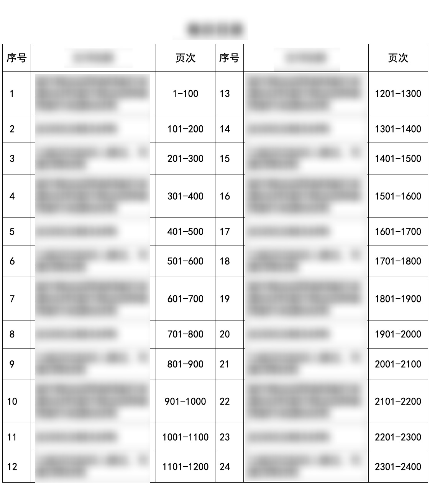
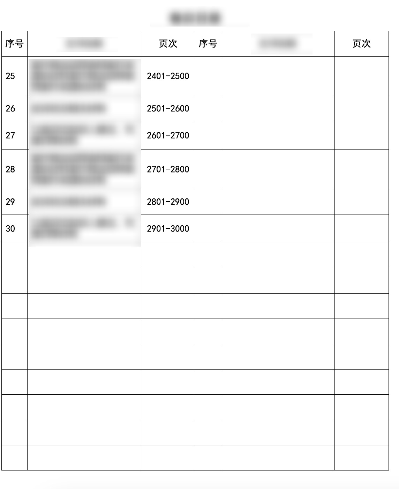

A4 图纸上绘画定高表格。首先是表格内容数据组装和表格内容数据替换。表格内容数据替换有几种实现方式。一种，借助 html 绘制 table 模板，使用 thymeleaf 做元素替换。一种，借助 word 和 书签绘制模板，使用 poi 完成书签替换。一种，使用 word 绘制 ftl 模板，使用 freemarker 完成元素替换。以上几种的表格内容数据替换方案，相对来说 html 模板和 ftl 模板是有比较好的延展性。

至于表格内容数据组装，按照业务组装即可。最近有这种“定高”表格需求，故而在此分享。按两分列展示表格内容，每个分列占用 3 列，总共一行 6 列展示两个业务数据。





### 需求点识别

1. 要求在固定高度下尽可能展示的行数。

2. 要求序号和页次不可换行，且跨页对齐。

3. 要求单页内元素不够的用空行占据。

4. 序号单页内左侧从n~m，序号单页内右侧从 m+1~2m。

### 设计及实现

#### NO1，设计使用 html 模板

使用 html 模板 + thymeleaf 替换 `th:` 类标签。使用 html  模板是因为可以通过 css 调整样式，并且能够按定制需求完成分页。

其中， A4 对应像素 `794px * 1123px` ，表格的宽高设置为 A4 的 85%，即 `675px * 955px` 。设置表头内容无颜色居中。

```html
<div style="width:794px;height:1123px">
    <table class="table-bordered table">
        <tr>
            <td colspan="6" style="font-size: 25px; border-style: none;">表头描述</td>
        </tr>
    </table>
</div>
```

```css
    * {
            font-family: SimHei;
            font-size: 18px;
            text-align: center;
        }

.table {
            width: 85%;
            border-collapse: collapse !important;
            margin: auto auto;
        }
.table th,
.table td {
            height: 35px;
            padding: 0.35rem;
        }
 .table-bordered th,
 .table-bordered td {
            border: 1px solid #000000;
        }
```

#### NO2，序号、内容、页次，表格中单个元素组各个单元格的宽度和高度

序号和页次高度只有一行，千万不要换行。内容会因为单元格内容长短可能存在换行。因为表格宽度为 675px，内容宽度 = 675 - 序号宽度 - 页次宽度。还有，半角字符占用 10 px，全角字符占用 18px。其中英文相关字符为半角字符，中文相关字符为全角字符。序号和页次使用阿拉伯数字表示，为半角字符。所以，序号和页次占用宽度为 长度 * 10px。序号的最大长度为元素组 size 长度，页次的最大长度为元素组最后一个的页次长度，序号和页次的高度为 `.table td` 样式高度 35 px。

```java
List<MuluTreeNode> nonEmptyMulus = muluJiegouParam.getNonEmptyMulus();
int muluNum = nonEmptyMulus.size();
// 序号宽度
int xhWidth = 10 * Objects.toString(muluNum).length();
// 页次宽度
MuluTreeNode lastMuluTreeNode = nonEmptyMulus.get(muluNum - 1);
String lastPageInfo = lastMuluTreeNode.getPageInfo();
int yeciWidth = 10 * lastPageInfo.length();
```

内容高度，则是对单元格内容每个字符使用正则表达式 `[\x00-\xff]` 判断是否半角字符累计宽度，宽度不可大于内容定宽，循环累计几次后确定行数 lines。如果 lines 为单行则高度为 35 px，如果 lines 为 2+ 行则高度为 `21px * lines`。

```java
int tempContentWidthPx = contentWidthPx;
String content = muluJiegouItem.getContent();
int length = content.length();
Pattern pattern = Pattern.compile("[\\x00-\\xff]");
int line = 0;
for (int index = 0; index < length;) {
    String contentIdx = StringUtils.substring(content, index, ++index);
    Matcher matcher = pattern.matcher(contentIdx);
    int itemWidthPx = matcher.find() ? HALF_WIDTH_CHAR_PX : FULL_WIDTH_CHAR_PX;
    int nextContentWidthPx = tempContentWidthPx - itemWidthPx;
    if (nextContentWidthPx > 0) {
        tempContentWidthPx = nextContentWidthPx;
    } else {
        line++;
        tempContentWidthPx = contentWidthPx - itemWidthPx;
    }
}
++line;
// 其中 35 为单行高度像素，21 * line 为多行高度像素，14 为 padding-top + padding-bottom
int heightPx = (line == 1 ? 35 : 21 * line) + 14;
```

#### NO3，确定左侧能装载元素长度，索引位（0~length-1）

以单页定高 820 px 为上限，按照每个元素内容高度看单页左侧最多能装下多少元素。但是，元素集合高度总和小于 820 px时，需要用空行补充，至于多少个则是用 高度差值px/49px，其中 49px =  35px + 7px + 7px。

```java
private int confirmPageLeftLength(List<Integer> muluJiegouItemHeights) {
        int height = PAGE_CONTENT_HEIGHT;
        int pageLength = -1;
        int length = muluJiegouItemHeights.size();
        for(int index = 0; index < length; index++) {
            int tempHeight = height - muluJiegouItemHeights.get(index);
            if (tempHeight < 0) {
                break;
            }
            pageLength = index + 1;
            height = tempHeight;
        }
        if (pageLength == length && height > 0) {
            pageLength += height/49;
        }
        return pageLength;
    }
```

#### NO4，确定右侧能装载元素范围

最多能装载的元素为 **NO3** 左侧 length，索引为 `length ~ 2*length-1` 。但前提是右侧索引范围元素高度之和必须**小于**单页定高。对于 `2*length` 小于元素集合长度，需要用空单行填充元素集合（当然得先拷贝集合，否则会影响元素集合）。对于右侧索引范围元素高度之和大于单页定高，需要减少右侧元素的起止位置 `length-1 ~ 2*length-3`，也就是向前挪动 2 个元素（即单行元素）。而右侧索引范围元素高度，每个元素高度需要取左内容高度和右内容高度最大值，原因很简单总不能左侧和右侧不一样，那样会 “大小眼”。

最终，确认的右侧能填充的元素长度 final_length，那单页的元素长度为 `2*final_length` 索引位 `0 ~ 2*final_length - 1` 。

```java
private int confirmPageRightLength(List<Integer> muluJiegouItemHeights, int leftPageLength) {
        int length = muluJiegouItemHeights.size();
        if (leftPageLength >= length) {
            return leftPageLength;
        }
        int pageLength = 2 * leftPageLength;
        List<Integer> copyedHeights = new ArrayList<>(muluJiegouItemHeights);
        if (pageLength > length) {
            copyedHeights.addAll(IntStream.range(length, pageLength).boxed().map(num -> SINGLE_ROW_OFFSETHEIGHT_PX).collect(Collectors.toList()));
        }
        // 这段要改
        int finalLeftPageLength = leftPageLength;
        int height = IntStream.range(leftPageLength, pageLength)
                .map(index -> Integer.max(copyedHeights.get(index), copyedHeights.get(index - finalLeftPageLength))).sum();
        while(height > PAGE_CONTENT_HEIGHT) {
            leftPageLength--;
            pageLength = 2 * leftPageLength;
            int finalLeftPageLength2 = leftPageLength;
            height = IntStream.range(leftPageLength, pageLength)
                    .map(index -> Integer.max(copyedHeights.get(index), copyedHeights.get(index - finalLeftPageLength2))).sum();
        }
        return leftPageLength;
    }
```

#### NO5，依据 NO4 提供的 final_length 组装单页表格元素

到这里就没什么好说的就是组装左元素和右元素，到这里就相当简单啦，但是要记得删除已经处理过的元素，否则计算下一页的时候还要做索引偏移。哈哈，要说再见了。

```java
private List<MuluJiegouLineItem> buildMuluJiegouPage(List<Integer> muluJiegouItemHeights, List<MuluJiegouItem> muluJiegouItemList) {
        int pageLength = this.confirmPageLength(muluJiegouItemHeights);
        int removePageLength = pageLength;
        int length = muluJiegouItemHeights.size();
        if (pageLength >= length) {
            removePageLength = length;
        }
        List<MuluJiegouLineItem> page = IntStream.range(0, pageLength / 2).boxed().map(index -> {
            MuluJiegouItem left = getItem(index, muluJiegouItemList);
            MuluJiegouItem right = getItem(index + pageLength/2, muluJiegouItemList);
            return MuluJiegouLineItem.builder().left(left).right(right).build();
        }).collect(Collectors.toList());
        Iterator<Integer> muluJiegouItemHeightIter = muluJiegouItemHeights.iterator();
        Iterator<MuluJiegouItem> muluJiegouItemIter = muluJiegouItemList.iterator();
        IntStream.range(0, removePageLength).filter(index -> index <length).forEach(index -> {
            muluJiegouItemIter.next();
            muluJiegouItemIter.remove();
            muluJiegouItemHeightIter.next();
            muluJiegouItemHeightIter.remove();
        });
        return page;
    }
```

#### NO6，倒序描述的最后

倒序描述的最后是方法的入口，所以要测试的话，顺序得是 `NO1 => NO2 => NO6 => NO5 => NO3 => NO4`。

```java
private void buildMuluJiegouPages(MuluJiegouItems muluJiegouItems, List<MuluTreeNode> nonEmptyMulus) {
        int widthPx = muluJiegouItems.getContentWidth();
        List<MuluJiegouItem> muluJiegouItemList = this.convert(nonEmptyMulus, widthPx);
        List<Integer> muluJiegouItemHeights = muluJiegouItemList.stream().map(MuluJiegouItem::getHeightPx).collect(Collectors.toList());
        List<List<MuluJiegouLineItem>> pages = new ArrayList<>();
        while(CollectionUtils.isNotEmpty(muluJiegouItemHeights)) {
            pages.add(buildMuluJiegouPage(muluJiegouItemHeights, muluJiegouItemList));
        }
        muluJiegouItems.setPages(pages);
    }
```

