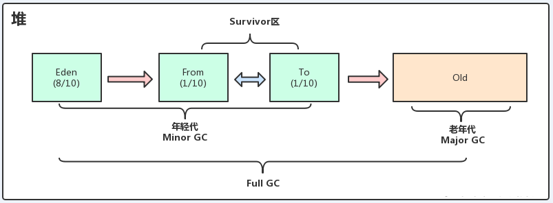
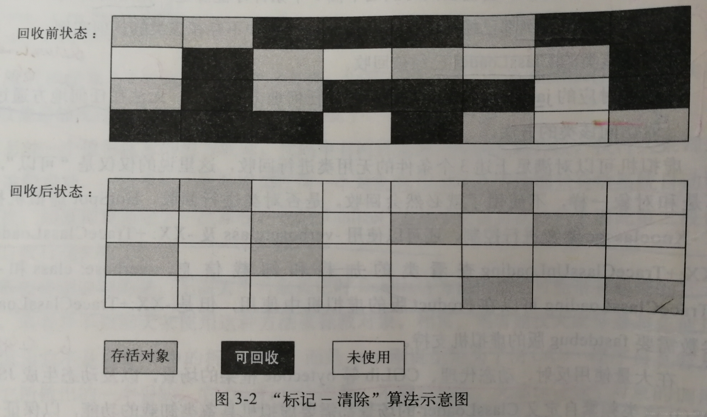
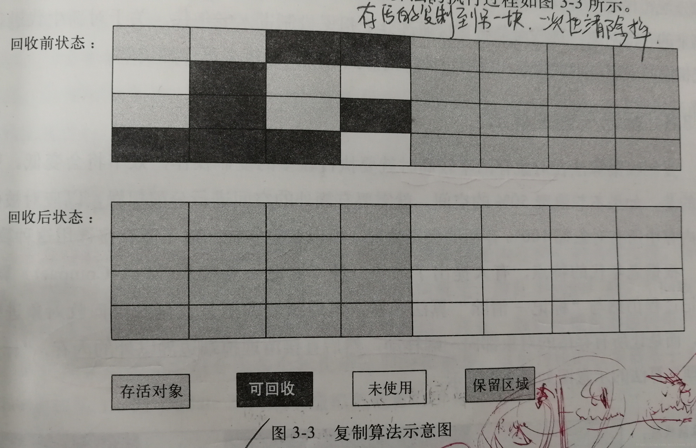
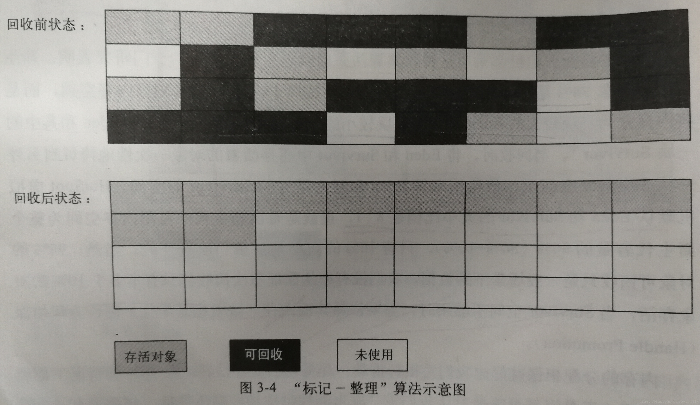
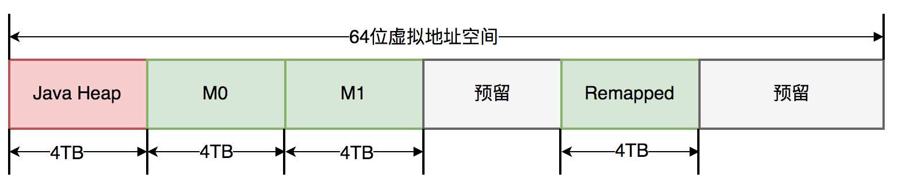

### 堆内存分配

JVM 将堆内存划分为新生代、老年代和 metadata 空间。新生代被分为 eden 空间、Survivor From 空间、Survivor To 空间。垃圾回收基本是对 eden 空间、Survivor From 空间和老年代的内存回收。但是，不是每次垃圾回收都会触发老年代的内存回收，这个在 [垃圾回收器们](#垃圾回收器们) 会再次总结。



### 回收对象

当对象不再被引用时，此时对象被认为是**垃圾对象**，会在垃圾回收器运行时被回收。在 JVM 有强引用、弱引用、软引用和虚引用四种对象引用类型。其中，**强引用**，为最常见的引用类型，通过关键字 new 创建的对象默认是强引用。只要强引用指向一个对象就表示对象依旧活着。**弱引用**，将对象引用保存在弱引用对象中，如果垃圾回收器运行时，这个弱引用对象对垃圾回收器而言依旧会被回收。而弱引用使用场景，在没有强引用指向的对象时，在被 GC 前还能通过弱引用来获取对象，使用该对象并能再次用一个强引用指向它，不用重新运行逻辑装载对象。**软引用**，对象应用保存在软引用对象中，垃圾回收器运行时会判断堆内存是否充足。如果充足，垃圾回收器不会在当下回收被软引用对象指向的对象。如果不充足，垃圾回收器会立即回收被软引用对象指向的对象。**虚引用**，将对象引用保存在虚引用对象中，通过虚引用对象无法获取指向的对象，除非对象强引用未断连。如果垃圾回收器运行时，虚引用对象指向对象回收后，垃圾回收器会把这个虚引用加入到与之关联的引用队列中。程序可以通过判断引用队列中是否已经加入了虚引用，来了解被引用的对象是否将要被垃圾回收，完成对象回收后的资源释放。

```java
    String test = new String("test123");
    // 弱引用
    WeakReference<String> testWeakReference = new WeakReference<String>(test);
    testWeakReference.get();
    // 软引用
    SoftReference<String> testSoftReference = new SoftReference<String>(test);
    testSoftReference.get();
    // 虚引用
    ReferenceQueue<String> referenceQueue = new ReferenceQueue();
    PhantomReference<String> testPhantomReference = new PhantomReference<String>(test, referenceQueue);
    // 虚引用通过队列 poll 判断 test 被回收.
    referenceQueue.poll();
```

### 垃圾回收器算法

#### 标记-清理（Mark-Sweep)

首先，扫描整个空间通过对象可达性判断找到没有被引用的对象，标记这类对象需要清理。其次，扫描整个空间清理被标记的对象。缺点，直接清理标记对象，可能会照成内存空间碎片化。需要整个空间扫描两次。



#### 复制（Copying）

将内存划分为两个大小相等的空间，保证每次仅有一个空间被使用。当被使用的空间快用完触发回收时，需要在当前空间扫描出活跃对象，将活跃对象拷贝到另一个未使用空间，清理使用空间（这时使用空间就会变成未被使用空间）。缺点，内存运行时被使用空间为 1/2。



在 JVM 运行过程中，大部分对象是 “朝生夕死” 约占 98%。也就是说真正需要长期活着的对象占用少。也就说明这样的对半空间，不算浪费很多。其中，98% 对象在 eden 区域在内存划分中占大头默认比例为 80%。复制算法作用于 Survivor From 空间  和 Survivor To 空间，默认占用 10%。

#### 标记-整理（Mark-Compact）

标记依旧是标记需要清理的对象。整理是将存货的对象向一端移动，然后将边界外的对象清理掉。这样没有内存碎片。与清理相比，整理后没有内存碎片。与拷贝相比，整理并没有划分出一半空闲空间。



### GC 术语

部分收集（Partial GC），目标不是完整收集整个 Java 堆的垃圾收集。其中，新生代收集（Minor GC/Young GC），目标只是新生代的垃圾收集。老年代收集（Major GC/Old GC），只是老年代的垃圾收集，目前只有 CMS 会有单独收集老年代的行为，另外请注意 Major GC 这个说法现在有点混淆，在不同资料上常有不同所指，读者需按上下文区分到底是指老年代的收集还是整堆收集。混合收集（Mixed GC），目标是收集整个新生代以及部分老年代的垃圾收集，目前只有 G1 s回收器会有这种行为。整堆收集（Full GC），收集整个 Java 堆的垃圾收集。

可以作为 GC Root 对象的有，虚拟机栈（栈帧中的本地变量表）中引用的对象、方法区中类静态属性引用的对象、方法区中常量引用的对象、本地方法栈中 JNI 引用的对象。

### 垃圾回收器们

以算法来说，分代回收是按照不同区域的特点，选用适合的垃圾回收算法和垃圾回收器，年轻代垃圾回收频繁追求响应时间短和程序终止时间短。分为年轻代回收器，Serial、ParNew、Parallel Scavenge、G1、ZGC。老年代回收器，SerialOld 、Parallel Old、CMS、G1。

#### Serial

串行回收器，最古老、最简单的垃圾回收器。进行垃圾收集时只使用一个线程。使用的是标记复制算法。在标记和复制两个环节上，暂停所有应用线程（`stop-the-word`）。

#### Serial Old

单线程串行老年代标记整理算法的垃圾回收。与 Serial 匹配的老年代垃圾回收器。如果老年代内存大，意味着垃圾回收耗时很长。

#### Parallel Scavenge

使用标记复制算法及多线程进行年轻代垃圾回收。但与 ParNew 相比，它能达到一个可控的吞吐量。吞吐量 =  CPU 运行用户线程时间 / CPU 总时间。使用 `-XX:MaxGCPauseMillis` 最大垃圾收集停顿时间，`-XX:GCTimeRatio` 垃圾回收时间占总时间比例。如果设置时间变短，这意味着回收更加频繁，导致吞吐量降低。

#### Parallel Old

多线程并行老年代标记整理算法的垃圾回收，吞吐量优先的垃圾回收器。与 Parallel Scavenge 匹配的老年代垃圾回收器。使用 `-XX:UseParallelOldGC` 开启此垃圾回收器。

#### ParNew

使用标记复制算法及多线程进行年轻代垃圾回收。垃圾回收过程中，会暂停所有应用线程。`-XX:ParallelGCThreads` 设置垃圾回收器并行执行线程数，默认开启和 CPU 数据相同的线程数。

#### CMS

CMS 采用标记清除算法，只会回收老年代空间。CMS 是一种预处理垃圾回收器，需要在老年代内存耗尽前完成垃圾回收，否则会导致并发回收失败，失败会退化为 SerialOld 垃圾回收器。因此 CMS 可设置 `-XX:CMSInitiatingOccupancyFraction` 确定开始垃圾回收启动阈值。`-XX:+UseConcMarkSweepGC` 启动 CMS 老年代垃圾回收。

**CMS 初始标记（STW）**，标记老年代 GC Roots 直接引用对象，`-XX:+CMSParallelInitalMarkEnabled` 开启标记并行化，`-XX:ParallelGCThreads` 线程数不要超过 CPU 核数。

**CMS 并发标记**，沿着初始标记的对象寻找存活对象，该阶段与应用程序并发运行。需要对并发标记过程中，对老年代对象引用关系发生变更，需要重新标记（会标记为 Dirty）。并发标记时，用不同颜色标记（三色标记法）老年代对象，黑色表示对象已经被扫描过且存活、灰色表示对象至少存在一个引用还没有被扫描过、白色表示对象没有被扫描过。

**并发预处理**，并发预清理主要是处理并发阶段因引用关系发生变更而未标记到的存活对象（即：扫描所有标记为Dirty 的 Card ）。

**可终止预处理**，可终止预处理阶段与并发预处理节点一样，主要是处理并发阶段因引用关系发生变更而未标记到的存活对象（即：扫描所有标记为 Dirty 的 Card ）。但是可终止预处理是有条件触发的，触发条件由CMS的两个参数控制 `-CMSScheduleRemarkEdenSizeThreshold` 默认值 2M 和 `-CMSScheduleRemarkEdenPenetration` 默认值 50%，当 Eden 空间使用超过 2M 时，启动可终止预处理，当 Eden 空间使用率到达 50% 时中断，进入重新标记阶段。

**重新标记（STW）**，主要是标记整个老年代的所有的存活对象，该阶段会扫描整个堆内存。扫描新生代的原因是因为老年代中的对象，如果被新生代中的对象引用，会被视为存活对象，即使新生代的对象已经不可达，也会使用这些不可达的对象当GC Root 来扫描老年代。重新标记阶段耗时较长，可以通过设置参数`-XX:+CMSScavengeBeforeRemark` 在重新标记前先执行一次 Minor GC，回收掉新生代中不可达对象，并将剩余对象转入幸存者区或晋升到老年代，这样在扫描新生代时，只需要扫描幸存者区对象即可，将大大减少扫描对象所需时长。

同时，可通过设置 `-CMSParallelRemarkEnabled` 开启并行重新标记，提高标记效率，减少重新标记处理时长。

**并发清除**，主要是清除那些没有被标记的对象，回收内存空间。但过程中产生的垃圾只能在下次 GC 中处理。因为是清理方法产生的碎片，因变量 `-XX:UseCMSCompactAtFullCollection` 压缩开关， `-XX:CMSFullGCsBeforeCompaction` 决定经过多少次 FullGC 之后进行空间压缩。

**并发重置**，主要是重置 CMS 数据结构，准备在下一个CMS生命周期中使用。

#### G1

G1 将 java 堆划分为多个大小相等的独立区域，JVM 建议将其分为 2048 个 Region，而 Region 大小为 堆大小/2048。G1 保留了年轻代和老年代概念，不再物理隔离，都是可以不连续 Region 集合。可以通过 `-XX:G1NewSizePercent` 设置新生代初始占比，通过 `-XX:G1MaxNewSizePercent` 设置新生代最大占比。一个 Region 可能之前是年轻代，如果 Region 进行了垃圾回收，之后可能又会变成老年代，也就是说Region的区域功能可能会动态变化。G1 有专门分配大对象的 Region 叫 **Humongous 区**（专门存放短期巨型对象不用直接进入老年代，可以节约老年代的空间，避免因为老年代空间不够的GC开销），大对象大小超过 150% Region 就会被放入 Humongous 区，如果一个对象太大会申请多个 Region，如果剩余 Region 不够对象空间，会触发一次 Full GC。Full GC 会收集年轻代、老年代和 Humongous 区。

G1 为每个分区各自分配一个 RSet（Remembered Set）它内部类似于一个反向指针，记录了其它 Region 对当前 Region 的引用情况。但因为如果引用源是本分区的对象，那么就不需要记录在 RSet 中、且同时 G1 每次 GC 时，所有的新生代都会被扫描，因此引用源是年轻代的对象，也不需要在 RSet 中记录，所以最终只需要记录老年代到新生代之间的引用即可。

Card，每个 Region 内部又被分成了若干个大小为512 Byte的 Card，标识堆内存最小可用粒度。分配的对象会占用物理上连续的若干个卡片。当查找对分区Region 内对象的引用时便可通过记录卡片来查找该引用对象。每个Region就有一个卡表来映射vRegion 中的卡页，整堆有个全局卡片表(`Global Card Table`) 存储所有Region的卡表情况。每一个Region的Card，都用一个 Byte 来记录是否修改过。卡表即这些byte的集合。实际上，如果把RS理解成一个概念模型，那么 Card Table 就可以说是 RSet 的一种实现方式。


垃圾回收过程，

1. 初始标记：标记 GC ROOT 能关联到的对象，需要STW
2. 并发标记：从 GCRoots 的直接关联对象开始遍历整个对象图的过程，扫描完成后还会重新处理并发标记过程中产生变动的对象。使用三色标记法标记对象。
3. 最终标记：短暂暂停用户线程，再处理一次，需要STW
4. 复制回收：更新 Regio n的统计数据，对每个Region的回收价值和成本排序，根据用户设置的停顿时间制定回收计划。再把需要回收的 Region 中存活对象复制到空的Region，同时清理旧的Region。需要STW。

**YongGC** ，要么 eden 区放满，要么 G1 计算回收时间接近 `-XX:MaxGCPauseMills` 设置值会触发。G1会收集每个 Region 回收之后的空间大小、回收需要的时间。根据评估得到的价值，在后台维护一个优先级列表，然后基于我们设置的停顿时间优先回收**价值收益最大**的 Region。但 YongGC 的标记-复制是全过程 STW。

**MixedGC**，老年代对占有率达到 `-XX:InitiatingHeapOccupancyPercent` 值触发，回收 Yong 和 部分Old（G1 优先队列的优先顺序）以及大对象区。主要使用复制算法，拷贝过程中发现没有足够的空 region 承载拷贝对象时触发 Full GC。

**FullGC**，STW 采用单线程进行标记、清理和压缩整理。

G1 是 jdk9+ 的默认垃圾回收器。

#### ZGC

ZGC 是 jdk11 引入极低延迟的垃圾回收器，号称能处理 TB 级内存且停顿时间（STW）不超过 10ms，停顿时间不会随着堆大小或者活跃对象的大小而增加。ZGC 目前而言不分代。ZGC Region 分为三种容量，小型 Region 为 2MB 用于放置小于 256 KB 的小对象，中型 Region 为 32MB 放置大于等于 256KB 但小于 4MB 对象，大型 Region 容量不固定必须为 2MB 的整数倍放置 4MB 或以上的大对象且每个大型 Region 中只会存放一个大对象。

ZGC 在标记、转移和重定位阶段几乎都是并发的，这是 ZGC 实现停顿时间小于 10 ms 目标的最关键原因。ZGC 分为多个阶段，初始标记、并发标记、再标记、并发转移准备、初始转移、并发转移。可见只有 初始标记、再标记 和初始转移 会 STW。


ZGC 实现多个并发过程，是依据**着色指针** 实现，而且仅在 64 位操作系统上可用，将 64 位虚拟地址空间划分为 [0~4TB) 对应Java堆，[4TB ~ 8TB) 称为M0地址空间，[8TB ~ 12TB) 称为M1地址空间，[12TB ~ 16TB) 预留未使用，[16TB ~ 20TB) 称为Remapped空间。ZGC使用了内存多重映射（Multi-Mapping）将多个不同的虚拟内存地址映射到同一个物理内存地址上，这是一种多对一映射。



初始标记和初始转移分别都只需要扫描所有GC Roots，其处理时间和GC Roots的数量成正比，一般情况耗时非常短。再标记阶段 STW 时间很短，最多1ms，超过1ms则再次进入并发标记阶段。即，ZGC 几乎所有暂停都只依赖于 GC Roots 集合大小，停顿时间不会随着堆的大小或者活跃对象的大小而增加。与ZGC对比，G1的转移阶段完全 STW，且停顿时间随存活对象的大小增加而增加。

从堆中读取对象，且对象中属性指向的对象，会加入读屏障。如果这时候对象在 GC 时被移动了，接下来 JVM 就会加上一个读屏障，这个屏障会把读出的指针更新到对象的新地址上，并且把堆里的这个指针“修正”到原本的字段里。这样就算 GC 把对象移动了，读屏障也会发现并修正指针，于是应用代码就永远都会持有更新后的有效指针，而且不需要 STW。

垃圾回收过程：

1. **初始化**：ZGC 初始化之后，整个内存空间的地址视图被设置为 Remapped，标记是在染色指针上。程序正常运行，在内存中分配对象，满足一定条件后垃圾回收启动，此时进入标记阶段。

2. **并发标记阶段**：第一次进入标记阶段时视图为 M0，如果对象被GC标记线程或者应用线程访问过，那么就将对象的地址视图从 Remapped 调整为 M0。所以，在标记阶段结束之后，对象的地址要么是 M0 视图，要么是 Remapped。如果对象的地址是 M0 视图，那么说明对象是活跃的；如果对象的地址是Remapped 视图，说明对象是不活跃的。

3. **并发转移阶段**：标记结束后就进入转移阶段，此时地址视图再次被设置为Remapped。如果对象被 GC 转移线程或者应用线程访问过，那么就将对象的地址视图从 M0 调整为 Remapped。

### 参考

- [JVM堆内存和非堆内存](https://xstarcd.github.io/wiki/Java/JVM_Heap_Non-heap.html)

- [万字详解，一文带你掌握 JVM 垃圾回收！](https://zhuanlan.zhihu.com/p/111016492)

- [ZGC 垃圾回收分析](https://mikechen.cc/16719.html)

- [垃圾回收器G1&ZGC详解](https://blog.csdn.net/u011107814/article/details/118420893)

- [G1 垃圾收集器详解 - 掘金](https://juejin.cn/post/7209266987049844791)

- [CMS 垃圾回收](https://cloud.tencent.com/developer/article/1897189)

- [新一代垃圾回收器ZGC的探索与实践 - 美团技术团队](https://tech.meituan.com/2020/08/06/new-zgc-practice-in-meituan.html)

- [JVM ZGC 内存管理 | JustNote](https://www.selinux.tech/java/core/jvm-zgc-memory)

- [深入解析ZGC垃圾回收器 - Booksea - 博客园](https://www.cnblogs.com/booksea/p/17665685.html)
