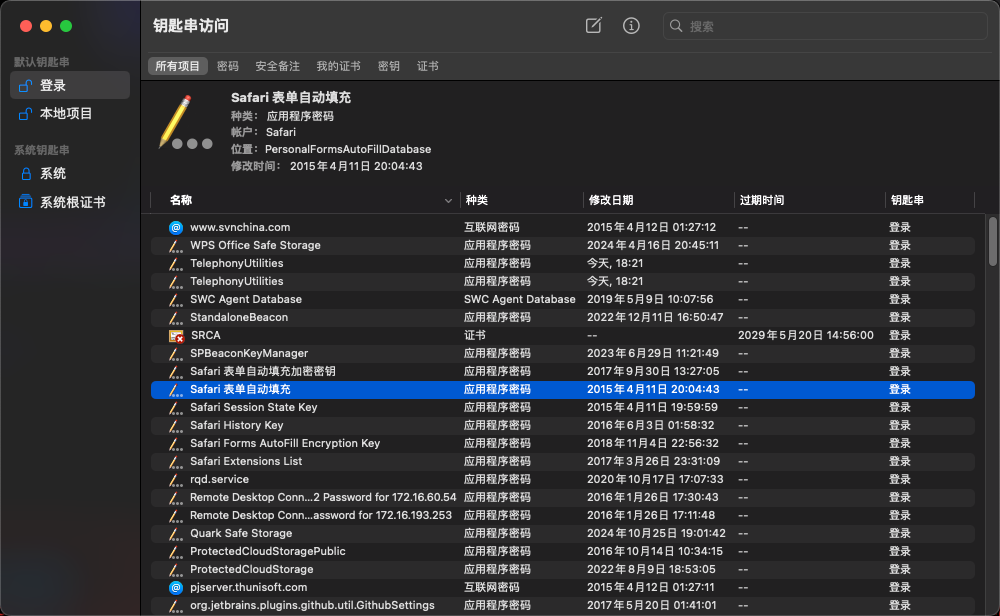
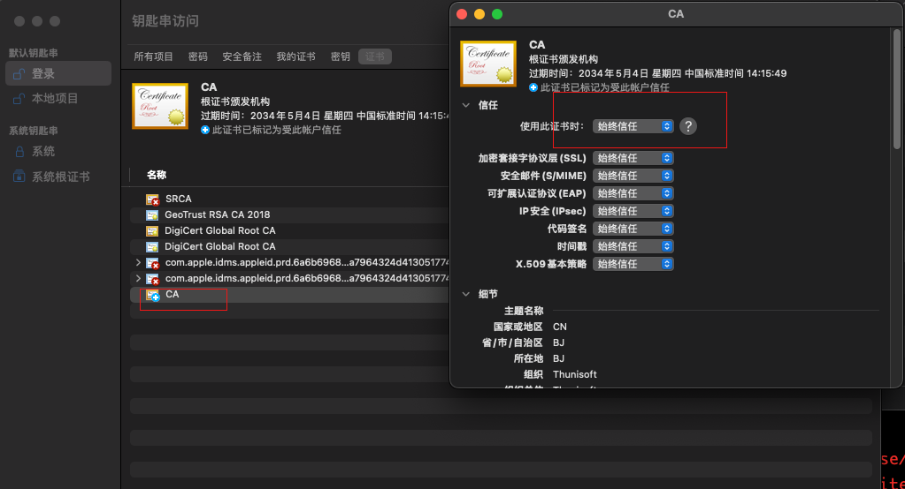

chrome 浏览器访问 https 都会需要验证证书，可以手动添加 CA 证书。Mac 手动添加 CA 证书是在 `实用工具 => 钥匙串访问.app` 中操作。而在 app 中，分为**默认钥匙串 => 登录**、**默认钥匙串 => 本地项目**、**系统钥匙串 => 系统**、**系统钥匙串 => 系统根证书**。

自签的 CA 证书，有且只能在 **默认钥匙串 => 登录** 或**系统钥匙串 => 系统** 两个分组上做 **文件菜单 => 导入项目** 进行导入。导入成功后在证书页签下查看新增的证书，并右键选择 **显示简介** 后信任处选择 **始终信任**。

