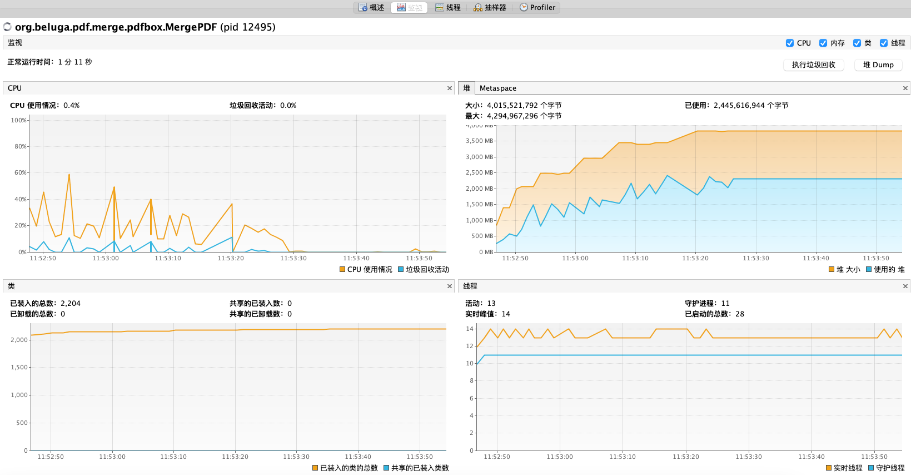

目前在市面上流通的 java PDF 操作组件有 [PDFbox](https://pdfbox.apache.org/) 和 [itextPDF](https://itextpdf.com/)，当然商用的不在我们讨论的范围内。其实， itextPDF 也是有商用版本，但好像免费版本也适合大多场景使用，其次也没别的什么免费组件共选择与比对。

### 简介

#### itextPDF

itextPDF 属于半免费半商业的选择。在官网上也明确告知什么组件是免费开源的什么组件是闭源，供你按需方便的选择。在 itext 8 产品组下，

- [iText Core](https://itextpdf.com/en/products/itext-7/itext-7-core) (开源) 
- [pdfCalligraph](https://itextpdf.com/en/products/itext-7/pdfcalligraph) (闭源) 
- [pdfHTML](https://itextpdf.com/en/products/itext-7/pdfhtml)***** (开源) 
- [pdfOCR](https://itextpdf.com/en/products/itext-7/pdfocr "pdfOCR") (开源)
- [pdfSweep](https://itextpdf.com/en/products/itext-7/pdfsweep) (开源) 
- [pdfXFA](https://itextpdf.com/en/products/itext-7/pdfxfa)***** (闭源) 
- [pdfOptimizer](https://itextpdf.com/en/products/itext-7/compress-pdf-pdfoptimizer) (闭源)

#### PDFBox

PDFBox 是 apache 开源项目，PDF 可操作的基本上都支持，也是市面上被追捧的项目，项目比较活跃。

> :bulb: 声明，仅站在大文件合并过程的场景上分享选择过程，与使用小心得。

### 合并代码、耗时及性能情况

#### itextPDF 8.0.5

```java
long start = System.currentTimeMillis();
String mergedFilePath = "/Users/liull/Downloads/merge/itext8_" + index + ".pdf";
String mergeSourcePdfDir = "/Users/liull/Downloads/PDF文件";
File[] files = new File(mergeSourcePdfDir).listFiles();
List<File> pdfFiles = Arrays.stream(files).filter(file -> file.getName().endsWith("pdf")).collect(Collectors.toList());
int failedFileCount = 0;
try(OutputStream fileOut = new FileOutputStream(mergedFilePath)) {
    PdfDocument pdfWriterDoc = new PdfDocument(new PdfWriter(fileOut));
    for(File file: pdfFiles) {
        try(InputStream in = new FileInputStream(file)) {
            PdfDocument pdfReaderDoc = new PdfDocument(new PdfReader(in));
            int count = pdfReaderDoc.getNumberOfPages();
            try {
                pdfReaderDoc.copyPagesTo(1, count, pdfWriterDoc);
                pdfWriterDoc.flushCopiedObjects(pdfReaderDoc);
            } catch(Exception e) {
                failedFileCount++;
                System.out.println(file.getAbsolutePath());
                System.out.println(e.getMessage());
            } finally {
                pdfReaderDoc.close();
            }


        }
    }
    pdfWriterDoc.close();
}
long end = System.currentTimeMillis();
System.out.println("merge cost " + (end-start) + "ms, files:" + pdfFiles.size() + ", failed:" + failedFileCount);
```

机器资源，内存 4GB CPU 8核（mac）

| 材料量                 | 并发量 | 耗时情况     | 是否 OOM |
| ------------------- | --- | -------- | ------ |
| 323 个材料<br>986.3 MB | 1   | 12,139ms | 否      |
| 323 个材料<br>986.3 MB | 5   | 24,482ms | 否      |
| 323 个材料<br>986.3 MB | 10  | 52,162ms | 否      |
| 323 个材料<br>986.3 MB | 15  | 无        | 是      |

以下是单线程的 JVM 情况


以下是 10 并发的 JVM 情况


每个材料在 copy 完成后, 通过 `pdfWriterDoc.flushCopiedObjects(pdfReaderDoc);` 刷到硬盘上。

#### PDFBox 3.0.3

```java
long start = System.currentTimeMillis();
String mergeSourcePdfDir = "/Users/liull/Downloads/PDF文件";
File[] files = new File(mergeSourcePdfDir).listFiles();
List<File> pdfFiles = Arrays.stream(files).filter(file -> file.getName().endsWith("pdf")).collect(Collectors.toList());
PDFMergerUtility pdfMergerUtility  = new PDFMergerUtility();
pdfMergerUtility.setAcroFormMergeMode(PDFMergerUtility.AcroFormMergeMode.PDFBOX_LEGACY_MODE);
pdfMergerUtility.setDocumentMergeMode(PDFMergerUtility.DocumentMergeMode.OPTIMIZE_RESOURCES_MODE);
pdfMergerUtility.setIgnoreAcroFormErrors(true);
pdfMergerUtility.setDestinationFileName("/Users/liull/Downloads/merge/PDFBox_" + index + ".pdf");
for (File file : pdfFiles) {
    pdfMergerUtility.addSource(new RandomAccessReadBufferedFile(file));
}
MemoryUsageSetting memoryUsageSetting = MemoryUsageSetting.setupMixed(1024*1024*256);
memoryUsageSetting.setTempDir(new File("/Users/liull/Downloads/merge/temp"));
//                    MemoryUsageSetting memoryUsageSetting = MemoryUsageSetting.setupTempFileOnly();
pdfMergerUtility.mergeDocuments(memoryUsageSetting.streamCache);
long end = System.currentTimeMillis();
System.out.println("merge cost " + (end-start) + "ms");
```

机器资源，内存 4GB CPU 8核（mac）

| 材料量                 | 并发量 | 耗时情况     | 是否 OOM |
| ------------------- | --- | -------- | ------ |
| 323 个材料<br>986.3 MB | 1   | 30,899ms | 否      |
| 323 个材料<br>986.3 MB | 5   | 无        | 是      |

以下是单线程的 JVM 情况



**就性能比较结果而言，itext8 优秀于 PDFBox 的表现。**

