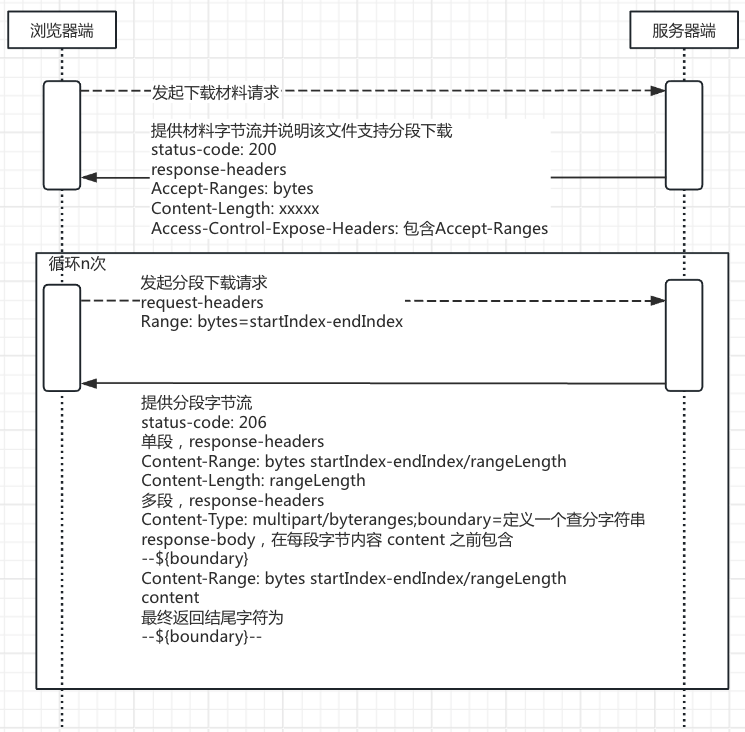

当出现大文件 pdf 装载时，pdf.js 使用分段下载和期望 pdf 是线性化 pdf 来达到尽可能快的加载 pdf 首页。对于小文件 pdf.js 则是等待 pdf 完整下载后再分析加载 pdf 首页。

但是，在项目运行过程中并没有看到 pdf.js 分段下载，不论 pdf 文件大小都需要等到下载完毕后 pdf.js 才开始渲染。<font color='red'>这中间一定有什么误会。</font>

因为对 pdf.js 并不熟悉，只能从 pdf 文件下载反向找逻辑，最终找出了问题所在，并盘一下 pdf.js 分段下载实现逻辑。

### 线性化 PDF 基础知识

线性化 PDF 主要聚焦于优化只读 PDF 文档的查看，线性化 PDF 最好是生成一次读取多次的场景。如果出现 PDF 内容变更，则需要重新构建线性化 PDF。而线性化 PDF 要求将第一页信息放在 PDF 前部位置，为了能让 WEB 端能快速加载第一页。其中，线性化 PDF 文档结构如下

```
<< /Linearized 1 /L 136764335 /H [ 632 76194 ] /O 27610 /E 776091 /N 5500 /T 136598419 >>

<< /Type /XRef /Filter /FlateDecode /Length 69 /W [ 1 3 1 ] /Index [ 27606 16 ]
   /ID [<6C3B266F4EDFA286BC2F2B6DF32B4233><41432D38312D46432D35412D39342D46>] 
   /Info 27603 0 R      
   /Root 27608 0 R      
   /Size 27622 /Prev 136598420  
 >>
stream
// PDF 其他文档结构内容....
```

- 线性化 header

    - `/Linearized`，标记线性化 PDF

    - `/L`，PDF 文件大小

    - `/H`，Primary hint stream 的起始位置及长度

    - `/O`，第一页的内容对象节点

    - `/E`，第一页结束的 offset

    - `/N`，PDF 总页数

- XRef Table，初始的 XRef 表，列出文件的开始对象，包括文档目录（TOC）、页对象和其他关键对象。

- 跟随 XRefTable 之后，包括第一页的数据和所有与第一页相关联的对象，如图像、字体和元数据。这些对象按顺序编号，以便快速加载第一页。

### 分段下载逻辑思路

分段下载是需要和后端交互 n+1 次，其中 n 为 `材料大小/分片大小` 值。大致分段下载流转如图



第 1 次，要求后端响应响应状态（`HttpStatus:200`），提供 `response-headers` 包含 `Accept-Ranges:bytes`、`Content-Encoding:identity`、`Content-Length:xxxxxx`（文件大小），但也要提供文件字节流写入 `Response Stream` 中，否则会导致请求卡停在后端处理。

第 2 到 n 次，需要提供请求 header 包含 `Range:bytes=startIndex-endIndex`，响应 header 包含 `Content-Range:bytes startIndex-endIndex/文件长度`、`Content-Length: 当前分段需要的内容长度` 和对应当前分段的文件字节流。

但是，第 1 次响应已经写入字节流，也就是文件内容。也要求在分段下载时，如果出现分段下载需求时，**需要将第 1 次请求终止不再接收后续字节** ，转而发起 2+ 次 range 请求。

### pdf.js 分段下载代码

第 1 次请求发起代码位置于 `pdf.worker.js` 的 `PDFNetworkStreamFullRequestReader` 函数

```javascript
function PDFNetworkStreamFullRequestReader(manager, options) {
  this._manager = manager;
  var source = options.source;
  var args = {
    onHeadersReceived: this._onHeadersReceived.bind(this),
    onProgressiveData: source.disableStream ? null : this._onProgressiveData.bind(this),
    onDone: this._onDone.bind(this),
    onError: this._onError.bind(this),
    onProgress: this._onProgress.bind(this)
  };
  this._url = source.url;
  this._fullRequestId = manager.requestFull(args);
  //....
}
PDFNetworkStreamFullRequestReader.prototype = {
_validateRangeRequestCapabilities: function PDFNetworkStreamFullRequestReader_validateRangeRequestCapabilities() {
    if (this._disableRange) {
      return false;
    }
    var networkManager = this._manager;
    if (!networkManager.isHttp) {
      return false;
    }
    var fullRequestXhrId = this._fullRequestId;
    var fullRequestXhr = networkManager.getRequestXhr(fullRequestXhrId);
    if (fullRequestXhr.getResponseHeader('Accept-Ranges') !== 'bytes') {
      return false;
    }
    var contentEncoding = fullRequestXhr.getResponseHeader('Content-Encoding') || 'identity';
    if (contentEncoding !== 'identity') {
      return false;
    }
    var length = fullRequestXhr.getResponseHeader('Content-Length');
    length = parseInt(length, 10);
    if (!isInt(length)) {
      return false;
    }
    this._contentLength = length;
    if (length <= 2 * this._rangeChunkSize) {
      return false;
    }
    return true;
  },
_onHeadersReceived: function PDFNetworkStreamFullRequestReader_onHeadersReceived() {
    if (this._validateRangeRequestCapabilities()) {
      this._isRangeSupported = true;
    }
    var networkManager = this._manager;
    var fullRequestXhrId = this._fullRequestId;
    if (networkManager.isStreamingRequest(fullRequestXhrId)) {
      this._isStreamingSupported = true;
    } else if (this._isRangeSupported) {
      networkManager.abortRequest(fullRequestXhrId);
    }
    this._headersReceivedCapability.resolve();
  }
}
```

分段请求发起代码位置 `pdf.worker.js` 的 `loadDocument` 函数

```javascript
function loadDocument(recoveryMode) {
      var loadDocumentCapability = createPromiseCapability();
      var parseSuccess = function parseSuccess() {
        var numPagesPromise = pdfManager.ensureDoc('numPages');
        var fingerprintPromise = pdfManager.ensureDoc('fingerprint');
        var encryptedPromise = pdfManager.ensureXRef('encrypt');
        Promise.all([numPagesPromise, fingerprintPromise, encryptedPromise]).then(function onDocReady(results) {
          var doc = {
            numPages: results[0],
            fingerprint: results[1],
            encrypted: !!results[2],
            info: pdfManager._info
          };
          loadDocumentCapability.resolve(doc);
        }, parseFailure);
      };
      var parseFailure = function parseFailure(e) {
        loadDocumentCapability.reject(e);
      };
      pdfManager.ensureDoc('checkHeader', []).then(function () {
        pdfManager.ensureDoc('parseStartXRef', []).then(function () {
          pdfManager.ensureDoc('parse', [recoveryMode]).then(parseSuccess, parseFailure);
        }, parseFailure);
      }, parseFailure);
      return loadDocumentCapability.promise;
    }
Util.inherit(NetworkPdfManager, BasePdfManager, {
    ensure: function NetworkPdfManager_ensure(obj, prop, args) {
      var pdfManager = this;
      return new Promise(function (resolve, reject) {
        function ensureHelper() {
          try {
            var result;
            var value = obj[prop];
            if (typeof value === 'function') {
              result = value.apply(obj, args);
            } else {
              result = value;
            }
            resolve(result);
          } catch (e) {
            if (!(e instanceof MissingDataException)) {
              reject(e);
              return;
            }
            pdfManager.streamManager.requestRange(e.begin, e.end).then(ensureHelper, reject);
          }
        }
        ensureHelper();
      });
    });
ChunkedStreamManager.prototype = {
     sendRequest: function ChunkedStreamManager_sendRequest(begin, end) {
      var rangeReader = this.pdfNetworkStream.getRangeReader(begin, end);
      if (!rangeReader.isStreamingSupported) {
        rangeReader.onProgress = this.onProgress.bind(this);
      }
      var chunks = [],
          loaded = 0;
      var manager = this;
      var promise = new Promise(function (resolve, reject) {
        var readChunk = function (chunk) {
          try {
            if (!chunk.done) {
              var data = chunk.value;
              chunks.push(data);
              loaded += arrayByteLength(data);
              if (rangeReader.isStreamingSupported) {
                manager.onProgress({ loaded: loaded });
              }
              rangeReader.read().then(readChunk, reject);
              return;
            }
            var chunkData = arraysToBytes(chunks);
            chunks = null;
            resolve(chunkData);
          } catch (e) {
            reject(e);
          }
        };
        rangeReader.read().then(readChunk, reject);
      });
      promise.then(function (data) {
        if (this.aborted) {
          return;
        }
        this.onReceiveData({
          chunk: data,
          begin: begin
        });
      }.bind(this));
    },
_requestChunks: function ChunkedStreamManager_requestChunks(chunks) {
      var requestId = this.currRequestId++;
      var i, ii;
      var chunksNeeded = Object.create(null);
      this.chunksNeededByRequest[requestId] = chunksNeeded;
      for (i = 0, ii = chunks.length; i < ii; i++) {
        if (!this.stream.hasChunk(chunks[i])) {
          chunksNeeded[chunks[i]] = true;
        }
      }
      if (isEmptyObj(chunksNeeded)) {
        return Promise.resolve();
      }
      var capability = createPromiseCapability();
      this.promisesByRequest[requestId] = capability;
      var chunksToRequest = [];
      for (var chunk in chunksNeeded) {
        chunk = chunk | 0;
        if (!(chunk in this.requestsByChunk)) {
          this.requestsByChunk[chunk] = [];
          chunksToRequest.push(chunk);
        }
        this.requestsByChunk[chunk].push(requestId);
      }
      if (!chunksToRequest.length) {
        return capability.promise;
      }
      var groupedChunksToRequest = this.groupChunks(chunksToRequest);
      for (i = 0; i < groupedChunksToRequest.length; ++i) {
        var groupedChunk = groupedChunksToRequest[i];
        var begin = groupedChunk.beginChunk * this.chunkSize;
        var end = Math.min(groupedChunk.endChunk * this.chunkSize, this.length);
        this.sendRequest(begin, end);
      }
      return capability.promise;
    },
requestRange: function ChunkedStreamManager_requestRange(begin, end) {
      end = Math.min(end, this.length);
      var beginChunk = this.getBeginChunk(begin);
      var endChunk = this.getEndChunk(end);
      var chunks = [];
      for (var chunk = beginChunk; chunk < endChunk; ++chunk) {
        chunks.push(chunk);
      }
      return this._requestChunks(chunks);
    }
}
```

pdf.js 在分析过程中可以依据分析过程按需请求分段，比如需要第 100 段，则可以在第二个请求里直接指定要第 100 段的字节流。这样适用于首页装载。

### 后端实现分段下载问题代码

后端代码主要问题是未在第一次请求响应中提供 `Content-Length` header 导致没有触发分段下载。前端判断代码

```javascript
PDFNetworkStreamFullRequestReader.prototype = {
_validateRangeRequestCapabilities: function PDFNetworkStreamFullRequestReader_validateRangeRequestCapabilities() {
    if (this._disableRange) {
      return false;
    }
    var networkManager = this._manager;
    if (!networkManager.isHttp) {
      return false;
    }
    var fullRequestXhrId = this._fullRequestId;
    var fullRequestXhr = networkManager.getRequestXhr(fullRequestXhrId);
    if (fullRequestXhr.getResponseHeader('Accept-Ranges') !== 'bytes') {
      return false;
    }
    var contentEncoding = fullRequestXhr.getResponseHeader('Content-Encoding') || 'identity';
    if (contentEncoding !== 'identity') {
      return false;
    }
    var length = fullRequestXhr.getResponseHeader('Content-Length');
    length = parseInt(length, 10);
    if (!isInt(length)) {
      return false;
    }
    this._contentLength = length;
    if (length <= 2 * this._rangeChunkSize) {
      return false;
    }
    return true;
  }
}
```

range 修改后代码

```java
response.setCharacterEncoding(StandardCharsets.UTF_8.name());
response.setBufferSize(DEFAULT_BUFFER_SIZE);
response.setHeader(HttpHeaders.ACCESS_CONTROL_ALLOW_ORIGIN, "*");
response.setHeader(HttpHeaders.ACCESS_CONTROL_ALLOW_CREDENTIALS, "true");
response.setHeader(HttpHeaders.ACCESS_CONTROL_REQUEST_METHOD, "*");
response.setHeader(HttpHeaders.ACCESS_CONTROL_EXPOSE_HEADERS, StringUtils.join((new String[] {HttpHeaders.ACCEPT_RANGES,
                    HttpHeaders.CONTENT_RANGE, HttpHeaders.CONTENT_DISPOSITION, HttpHeaders.CONTENT_LENGTH,
                    HttpHeaders.TRANSFER_ENCODING, HttpHeaders.CONTENT_ENCODING}, ','));
// 设置 Content-Type
this.setResponseContentType(response, fileStoreName, fileName);
// 内容装载方式，是inline 或是直接下载
this.setResponseAttachment(response, request, StringKit.defaultIfBlank(fileName, fileStoreName),
                    responseContentDisposition);
// 
if (StringKit.isBlank(range)) {
  response.setHeader(HttpHeaders.ACCEPT_RANGES, "bytes");
  response.setContentLengthLong(文件长度);
  try (InputStream in = storageService.getInputStream(protocol)) {
            IOUtils.copyLarge(in, response.getOutputStream());
            response.flushBuffer();
        }
  return;
}
// 按range拷贝字节，需要设置header
// 单个 range header
response.setHeader(org.springframework.http.HttpHeaders.CONTENT_RANGE,
                    "bytes " + r.start + "-" + r.end + "/" + total);
            response.setStatus(HttpServletResponse.SC_PARTIAL_CONTENT);
// 多个 range header，响应体中按range 区分起始与结束标识
response.setContentType("multipart/byteranges; boundary=MULTIPART_BYTERANGES");
response.setStatus(HttpServletResponse.SC_PARTIAL_CONTENT);
out.println();
out.println("--MULTIPART_BYTERANGES");
out.println("Content-Range: bytes " + r.start + "-" + r.end + "/" + total);
// 填充 range 对应字节信息
// End with multipart boundary.
out.println();
out.println("--MULTIPART_BYTERANGES--");
```
