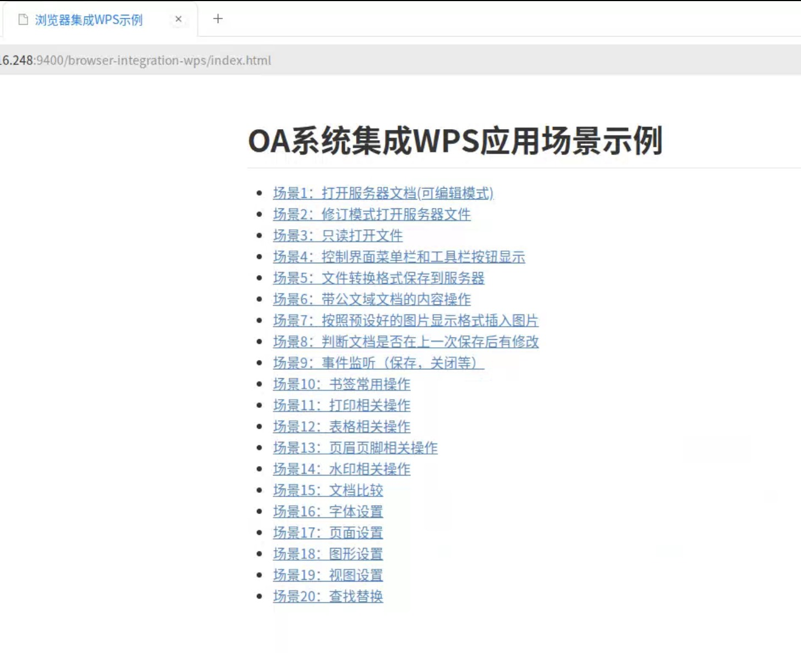

### 关于 NPAPI Chrome 内核的态度

Chrome 内核早在 V42 版本（2015年）开始默认关闭 NPAPI（Netscape Plugin API） 支持设置，在 V53 版本淘汰对 NPAPI 的支持。原因是，NPAPI 插件中的代码拥有当前用户的所有权限，对于恶意的输入不受到 Chrome 的任何保护。如果插件包含漏洞，攻击者可能会利用**漏洞**在用户的计算机上安装恶意软件。而后 Chrome 建议使用的 PPAPI（Pepper Plugin API） 插件，是由 Chrome 自身研发避免了 NPAPI 的缺点，但也在 2022 年 Chrome 内核 V107 版本放弃支持。

### 国产浏览器对 NPAPI 的态度

许多国产浏览器都是基于 Chrome 内核二次研发，但 TA 们对 NPAPI 却是支持的。在国产机器上安装 WPS 专业版本，会自动给浏览器安装 `Kingsoft WPS Plugin` 插件。以 UOS 浏览器为例，UOS 是基于 `Chrome/54.0.3239.132` 版本研发，通过 `uos://plugins` 可见。

### WPS 对 NPAPI 的态度

WPS 开发者平台是建议使用 WPS 加载项进行二次开发。但对 NPAPI 支持的浏览器也提供了集成的整套 demo 。具体在  [前-WPS开放平台](https://open.wps.cn/previous/docs/client/wpsLoad) 中 WPS 加载项 => WPS 集成模式 => 浏览器应用集成嵌入 WPS 指南 [wps: wps二次开发系统集成相关 - Gitee.com](https://gitee.com/zouyf/wps/tree/master/np-example/browser-integration-wps) ，基本上场景都包括了。



### FAQ

##### 问题1：只能打开空的 WPS 插件，但是看不到文档内容。

一般来说，是你的问题不会是 WPS 插件问题。在调用 ` this.pluginObj.OpenDocumentFromServer()`  的返回值中包含错误信息说明。

```json
{
    "result" : true,        
    "errMsg" : "错误信息",             
    "fileName" : "打开文件名",        
    "responseHead" : {
        "key1" : "value1",
        "key2" : "value2",
        "key3" : "value3"
        }            
}
```

##### 问题2：WPS 插件之上的 div 窗口会被挡住。

这种解决办法就是先将 Application 的 Visable 设置为 false，而后改为 true，并重新打开文档。

### 附件

- [谷歌最终将关闭 Chrome 应用程序，并终止对 NaCl、PNaCl 和 PPAPI API 的支持](https://techcommunity.microsoft.com/discussions/edgeinsiderdiscussions/good-news-google-is-finally-killing-off-chrome-apps-end-support-for-nacl-pnacl-a/1112057)
- [wps: wps二次开发系统集成相关 - Gitee.com](https://gitee.com/zouyf/wps/tree/master/np-example/browser-integration-wps)
