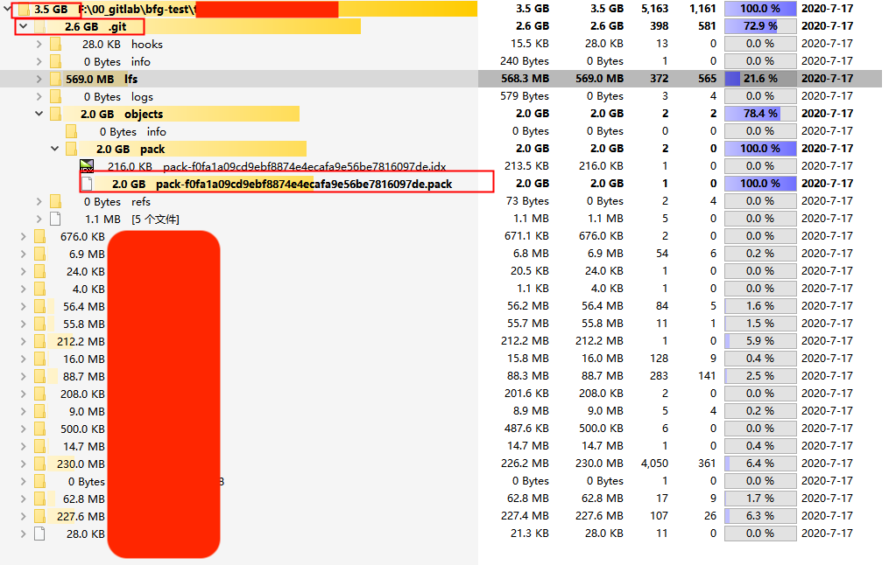
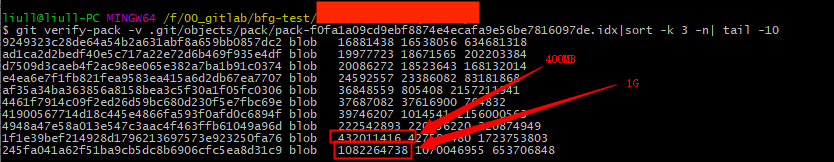
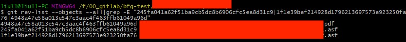
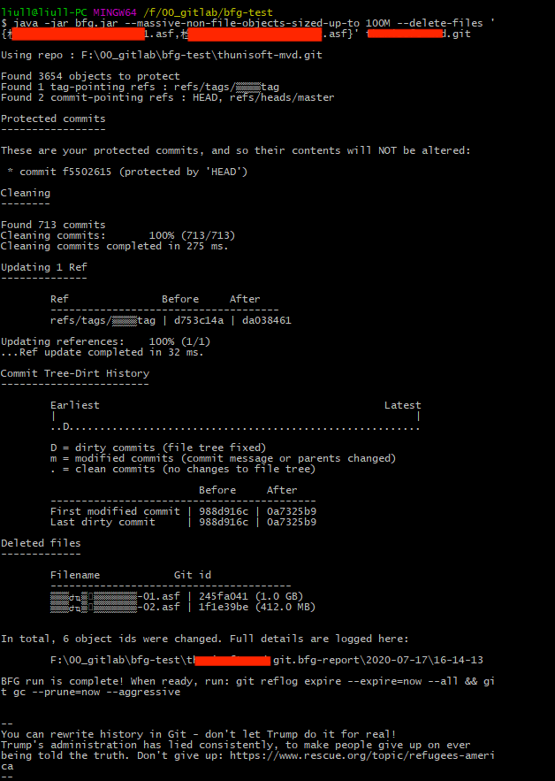
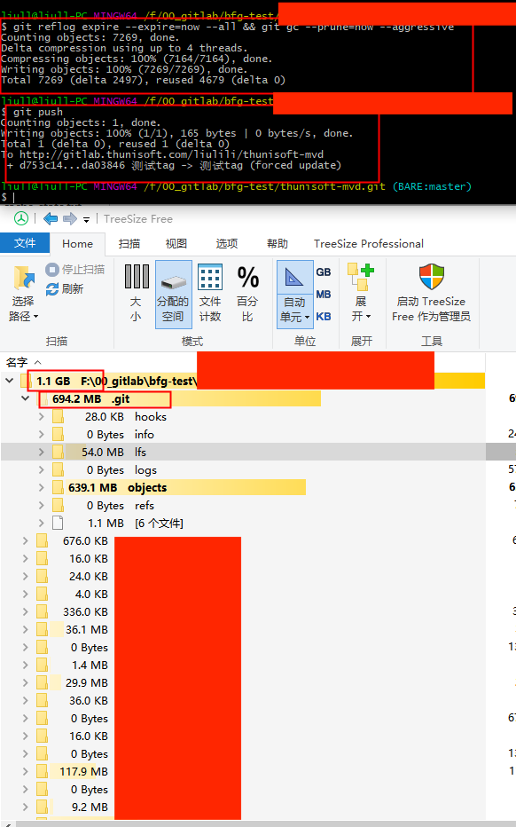
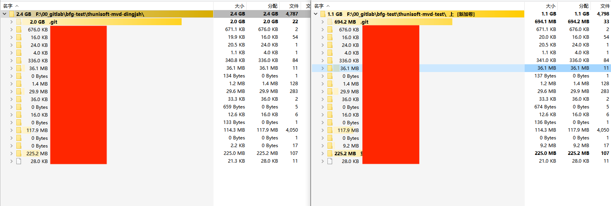

## :cat: 背景

`git clone` 项目耗时很长。原因，网速慢或是代码仓库文件很大(n+ G)。本篇文章就讲述如何给 `gitlab` 代码仓库减负。

### :dog: 基础知识

项目在 gitlab 中显示的仓库大小 = 项目文件总大小 + `.git` （隐藏）目录下文件大小。请认真关注你项目目录文件大小（windows 可以用 [treesize free](https://www.jam-software.com/treesize_free) / [SpaceSniffer](http://www.uderzo.it/main_products/space_sniffer/download_alt.html) 工具，linux 可以用命令 `du -h –max-depth=1 *`，mac 命令 `du -h -d 1 *` ），一般 `.git` 目录下文件大小 >= 项目文件大小。意味着，项目整体下载空间占用 >= 2 * 项目文件大小。所以，如果项目中包含比较大的文件，例如视频，高清照片等，把 gitlab 当做了**共享备份存储空间**是项目文件大的罪魁祸手。所以，项目初期代码一定和需求文档做剥离，除非你的项目足够的小。

### :fish: 拯救 git 仓库

对于需求文档类项目而言，建议用 `git lfs` 做大文件管理（此处 `git lfs` 不做过多介绍，请点击[链接](https://git-lfs.github.com/)了解）。请多想想后面加入的需求人，给他们的加入减少一些绊脚石。

> :bulb: 仅使用几次，过一个月之后基本不翻的东西、无需版本管理、内容超过 100 MB 的视频，请慎重放入 git 仓库

### :whale: 分析 git 大仓库

- windows 上使用 `TreeSize Free`  看看文件大小占比分布。发现，项目本身文件大小大约 900 MB ，`.git` 目录吃掉 2.6 GB。原因，其实上面基础知识算是解答了一部分，感兴趣的同学可以参考附件**git 原理**找答案。

  

- 使用 `git verify-pack`  命令运行  `git verify-pack -v .git/objects/pack/pack-f0fa1a09cd9ebf8874e4ecafa9e56be7816097de.idx|sort -k 3 -n| tail -10` ，查找出文件大小在前 10 的文件 hash 标识。注意，windows 上请使用 `git Bash Here ` 运行。

  

- 使用命令 `git rev-list` 运行 `git rev-list --objects --all|grep  hashId ` 定位大文件路径。此处，处理文件大小超过 100 MB。

  

- 按照路径和 `git log` 查找提交人，确定文件是否存在，且是否需要存在。s确定需要清理的为 `业务/检察院/检察院业务基础知识/检察院业务及工作流程-01.asf` 和 `业务/检察院/检察院业务基础知识/检察院业务及工作流程-02.asf` 两个文件。已经删除的文件，却在日志里能搜索出来，原因是防止你执行 `git revert` 还原到删除前的 commitId 版本。所以，清理原则就是需要**明确**哪些文件要删除，没有机会还原的话，就删除吧。

  > :bulb: 有重命名/移动目录需求，请使用 `git mv`  命令，而达到目录变更及命名功能。不要使用 `git mv` 和 `git add` 的方式，完成文件重命名或移动目录。这样会造成有删除的用不到的记录。

## :dolphin: 如何清理
> 在清理之前，建议所有人的分支都 push 到远端。否则，其他人的每次的 push 都会让你的清理都需要重新来一次。

目前，主要有两种方法：

- git 原生支持的 `filter-branch` 分支文件，命令 `git filter-branch --force --tree-filter 'rm -f path/to/big_file.mpg' HEAD` 。（不推荐。对于超多 commit 的项目，`filter-branch` 慢的怀疑人生，小编就是从 `git filter-branch` 放弃，转投 `BFG`）

-  `BFG` 工具

    - 执行命令 `git clone --mirror git-repository-url`  clone git 仓库

    - 执行命令 `java -jar bfg.jar --massive-non-file-objects-sized-up-to 100M --delete-files '{检察院业务及工作流程-01.asf,检察院业务及工作流程-02.asf}' thunisoft-mvd.git`。

      > `BFG` 对于需要清理的 history 会更改涉及文件的提交的 commit-id。具体老新 commit-id 的对应关系文件在 `thunisoft-mvd.git.bfg-report\2020-07-17\16-14-13\object-id-map.old-new.txt` 中 
      > 此时，`.git/objects` 下的  `pack/xxxxx.pack`  文件会被解压为  n 个 `git objects` 对象文件

    

- 执行命令 `git reflog expire --expire=now --all && git gc --prune=now --aggressive` ，将 git object 对象压缩。而后，执行命令 `git push` 推送远端。

  > 注意：推送之前解除仓库的 `Protected Branches` 的配置

  

- 请项目组所有成员放弃原本的本地项目仓库，重新 clone git 项目。因为，如果用原来的仓库你会发现本地 `.git` 会更大，因为除了 `git gc` 重新生成的 `pack` 文件之外，还有本地本身老的 `pack` 文件。

**最终和派生项目对比，除 `.git` 目录外其他相同。**

**为什么存在不到 1 KB 的文件？因为，本项目使用 `git lfs` 做了大文件管理，使用 `git lfs pull` 可以从远端拉下 1 KB 映射的原文件**
**清理完成，2.4 GB -> 1.1 GB 的转身**

## :lion: 特别说明

- 项目使用 `git lfs` 管理大文件之后，使用 `BFG` 清理完对项目本身没有任何影响。照样，可以使用 `git lfs` 命令管理文件。
- 真实项目在清理前，请先按照本文先 `clone` 出一份，熟悉一下清理流程，更有底气。

## :horse: 附录

- [git 原理-阮一峰](http://www.ruanyifeng.com/blog/2018/10/git-internals.html)
- [git 原理](https://zhuanlan.zhihu.com/p/45510461)
- [git 大文件清理-github](https://docs.github.com/cn/github/managing-large-files/removing-files-from-git-large-file-storage#removing-a-single-file)
- [git 大文件清理-gitlab](http://gitlab.thunisoft.com/help/user/project/repository/reducing_the_repo_size_using_git.md)，目前不用上传 `object-id-map.old-new.txt` 文件，走 “开始清理” 这步骤
- [git BFG](https://rtyley.github.io/bfg-repo-cleaner/)
- [git 练习场](https://learngitbranching.js.org/?locale=zh_CN)
- [git 学习文档](https://git-scm.com/book/zh/v2)
