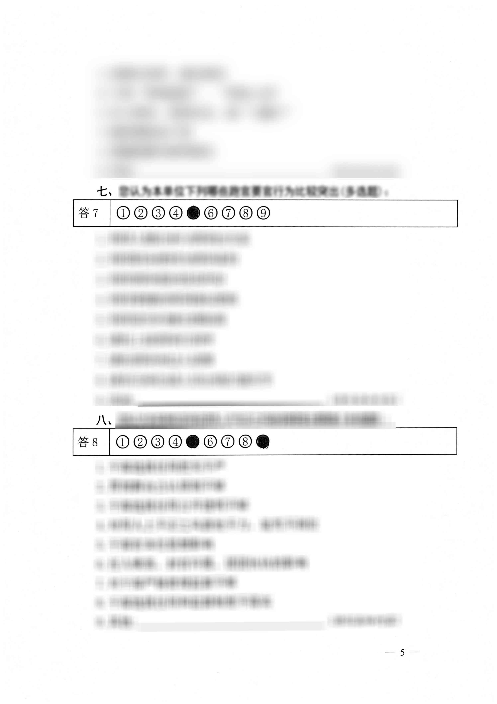
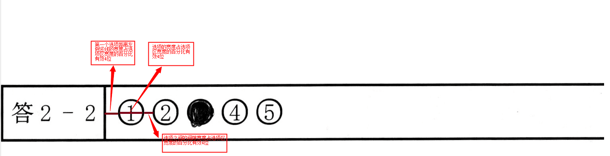

## java 通过 OpenCV 提取答题卡选择题答案

### 答题卡识别技术选型

OpenCV（Open Source Computer Vision Library） 是一种开源计算机视觉库，它提供了一些用于处理图像和视频的工具和算法。用于处理图片的纠偏。

tesseract-OCR，识别印刷体文字是轻量的 OCR 引擎。用于识别问题号。测试过 tesseract 的 java SDK `tess4j` 识别结果和直接使用 tesseract 命令识别结果不一样。最终我选了直接使用 tesseract 命令识别。

### 答题卡识别前置约束

1. 需要以固定的格式设置问卷

    - 答题区的宽度大于问题的宽度

      

    - 需要固定部分宽度的比例

      

2. 识别结果的好坏都和扫描图片的质量有关，建议是灰度 300dpi 扫描设置

### 答题卡识别关键代码

#### 获取答题区题号识别

```java
private List<String> getAnsTitles(String filePath) throws AnswerTitleException {
        String outPath = filePath.substring(0, filePath.lastIndexOf("."));
        File file = new File(outPath + ".txt");
        try {
            Runtime runtime = Runtime.getRuntime();
            String command = "tesseract " +  filePath + " " + outPath +" -l chi_sim ";
            Process ps = runtime.exec(command);
            ps.waitFor();
            // 读取文件
            String result = FileUtils.readLines(file, StandardCharsets.UTF_8).stream()
                    .map(line -> line.replaceAll("\n", StringUtils.EMPTY))
                    .collect(Collectors.joining(StringUtils.EMPTY));
            log.debug("{} result: {}", command, result);
            Pattern pattern = Pattern.compile("答\\s*\\d+\\s*[-]*\\s*\\d*");
            Matcher matcher = pattern.matcher(result);
            List<String> ansTitles = new ArrayList<>();
            while(matcher.find()) {
                ansTitles.add(matcher.group());
            }
            log.debug("{} result pattern: {}", command, ansTitles.stream().collect(Collectors.joining(",")));
            return ansTitles;
        } catch (Exception e) {
           throw new AnswerTitleException(MessageFormat.format("{0} answer-title-identify", filePath), e);
        } finally {
            FileUtils.deleteQuietly(file);
        }
    }

```

#### 通过 openCV 截取答题卡区域

```java
static {
  System.loadLibrary(Core.NATIVE_LIBRARY_NAME);
}
public void recognize(String filePath) {
         // 获取识别内容，确定答题号
            Mat srcImgMat = null;
            Mat cvtMat = null;
            Mat correctImgMat = null;
            try {
                List<String> ansTitles = getAnsTitles(filePath);
                srcImgMat = Imgcodecs.imread(filePath);
                cvtMat = new Mat();
                // 灰度
                Imgproc.cvtColor(srcImgMat, cvtMat, Imgproc.COLOR_BGR2GRAY);
                // 矫正
                correctImgMat = imgCorrector.correct(cvtMat, filePath);
                // 截答题区
                List<Mat> answerAreaMats = answerCutter.answerCut(correctImgMat, filePath);
                if (ansTitles.size() != answerAreaMats.size()) {
                    answerAreaMats.stream().forEach(ansAreaMat -> MatUtil.releaseMat(ansAreaMat));
                    throw new AnswerCutException("答题数和答案区数量不一致，跳过");
                }
                List<AnswerArea> answerAreas = new ArrayList<>(ansTitles.size());
                for(int i = 0; i < ansTitles.size(); i++) {
                    answerAreas.add(new AnswerArea(ansTitles.get(i), answerAreaMats.get(i)));
                }
                return answerAreas;
            } catch (CorrectException | AnswerCutException | AnswerTitleException e) {
                log.error("file:{}", filePath, e);
            } finally {
                MatUtil.releaseMat(srcImgMat);
                MatUtil.releaseMat(cvtMat);
                MatUtil.releaseMat(correctImgMat);
            }
            return Collections.emptyList();
}


@Getter
@Setter
@AllArgsConstructor
public class AnswerArea {

    private String title;

    private Mat areaMat;
}

```

##### 图片纠偏

图片纠偏，纠正角度超过 10 度的图片。

```java
public class ImgCorrector {

    private static final Scalar WHITE_PAGE = new Scalar(255, 255, 255);
    private static final int CANNY_KERNEL_SIZE = 3;
    private static final int CANNY_THRESHOLD = 40;
    private static final int CANNY_THRESHOLD_RATIO = 3;
    private static final int STRAIGHT_PINGJIAO = 180;
    private static final int STRAIGHT_ZHIJIAO = 90;
    private static final int THRESHOLD_300 = 300;
    private static final int THRESHOLD_200 = 200;
    private static final int THRESHOLD_100 = 100;

    /**
     * 矫正图片，当倾斜度超过 10 度都是不合理的矫正.
     * 保持原长宽，不适合大角度纠偏.
     * @param cvtMat 灰度Mat
     * @param filePath 文件路径
     * @return 矫正后的Mat
     */
    public Mat correct(Mat cvtMat, String filePath) throws CorrectException {
        Mat mat = null;
        try {
            double degree = calcSlope(cvtMat);
            // 当倾斜度超过 10 度都是不合理的矫正.
            if (BigDecimal.valueOf(0.0d).equals(BigDecimal.valueOf(degree)) || Math.abs(degree) > 10.0d) {
                log.warn("{} correct, if degree({}) is zero or bigger than 10 then no correct.", filePath, degree);
                return cvtMat;
            }
            log.debug("{} correct, degree({})", filePath, degree);
            Mat correctImgMat = new Mat();
            double length = cvtMat.width() > cvtMat.height() ? cvtMat.width(): cvtMat.height();
            // 确定翻转切入点
            Point point = new Point(length/2, length/2);
            mat = Imgproc.getRotationMatrix2D(point, degree, 1);
            Imgproc.warpAffine(cvtMat, correctImgMat, mat,
                    new Size(length, length), Imgproc.INTER_LINEAR, 0, WHITE_PAGE);
            if (log.isDebugEnabled()) {
                MatUtil.saveToTempFile(correctImgMat, filePath, "correct");
            }
            return correctImgMat;
        } catch (Exception e) {
            throw new CorrectException(e);
        } finally {
            releaseMat(mat);
        }
    }


    /**
     * 计算图片倾斜角度.
     * 1. Canny 提取图像边缘检测
     * 2. HoughLines 提取直线
     * @param cvtMat 灰度图片mat
     * @return 倾斜角度
     */
    private double calcSlope(Mat cvtMat) {
        Mat cannyMat = null;
        Mat blurMat = null;
        Mat straightLineMat = null;
        try {
            blurMat = new Mat();
            // 3x3 内核降噪
            Imgproc.blur(cvtMat, blurMat, new Size(3, 3));
            // canny 射线
            cannyMat = new Mat();
            Imgproc.Canny(blurMat, cannyMat,
                    CANNY_THRESHOLD, CANNY_THRESHOLD * CANNY_THRESHOLD_RATIO, CANNY_KERNEL_SIZE);
            // houghLines
            straightLineMat = new Mat();
            Imgproc.HoughLines(cannyMat, straightLineMat, 1, Math.PI/STRAIGHT_PINGJIAO,  THRESHOLD_300);
//            if(straightLineMat.rows() == 0 || straightLineMat.cols() == 0) {
//                Imgproc.HoughLines(cannyMat, straightLineMat, 1, Math.PI/STRAIGHT_PINGJIAO, THRESHOLD_300);
//            }
            if(straightLineMat.rows() == 0 || straightLineMat.cols() == 0) {
                Imgproc.HoughLines(cannyMat, straightLineMat, 1, Math.PI/STRAIGHT_PINGJIAO, THRESHOLD_200);
            }
            if(straightLineMat.rows() == 0 || straightLineMat.cols() == 0) {
                Imgproc.HoughLines(cannyMat, straightLineMat, 1, Math.PI/STRAIGHT_PINGJIAO, THRESHOLD_100);
            }
            if (straightLineMat.rows() == 0 || straightLineMat.cols() == 0) {
                System.out.println("没检测到直线，不纠偏");
                return 0.0d;
            }
            float average = getLineSlopeAvg(straightLineMat);
            return average / Math.PI * STRAIGHT_PINGJIAO - STRAIGHT_ZHIJIAO;
        } catch (Exception e) {
            e.printStackTrace();
        } finally {
            releaseMat(blurMat);
            releaseMat(cannyMat);
            releaseMat(straightLineMat);
        }
        return 0.0d;
    }

    private float getLineSlopeAvg(Mat lines) {

        Map<Boolean, List<Integer>> xIsX = new HashMap<>(lines.rows());
        for(int x=0; x < lines.rows(); x++) {
            double[] vec = lines.get(x, 0);
            boolean isX = isX(vec);
            List<Integer> indexs = xIsX.get(isX);
            if (!xIsX.containsKey(isX)) {
                indexs = new ArrayList<>();
                xIsX.put(isX, indexs);
            }
            indexs.add(x);
        }
        List<Integer> xIndexs = xIsX.getOrDefault(true, Collections.emptyList());
        List<Integer> yIndexs = xIsX.getOrDefault(false, Collections.emptyList());
        int countX = xIndexs.size();
        int countY = yIndexs.size();
        List<Integer> indexs = countX > countY ? xIndexs : countX < countY ? yIndexs: ListUtils.union(xIndexs, yIndexs);
        float sum = 0;
        for(int index: indexs) {
            double[] vec = lines.get(index, 0);
            double theta = vec[1];
            sum += theta;
        }
        return sum/indexs.size();
    }

    private boolean isX(double[] vec) {
        double rho = vec[0];
        double theta = vec[1];
        double a = Math.cos(theta), b = Math.sin(theta);
        double x0 = a*rho, y0 = b*rho;
        double point1x = Math.round(x0 + 1000*(-b));
        double point1y = Math.round(y0 + 1000*(a));
        double point2x = Math.round(x0 - 1000*(-b));
        double point2y = Math.round(y0 - 1000*(a));
        return Math.abs(point1x- point2x) > Math.abs(point1y - point2y);
    }

    private void releaseMat(Mat imgMat) {
        if (imgMat != null) {
            imgMat.release();
        }
    }
}
```

##### 截取答题卡区域

答题卡区域与问题区域的区别是在设置的答题卡区长度大于问题区域。这样就能简单的截取到答题卡区

```java
public class ImgAnswerCutter {

    private static final int THRESHOLD_MAX = 255;
    private static final int STRUCTURE_WIDTH = 50;
    private static final int STRUCTURE_HEIGHT = 3;
    private static final double POINT_HALF = 0.5;
    private static final double POINT_EIGHT = 0.8;
    private static final double POINT_NIGHTEIGHT = 0.98;
    private static final double FILTER_HEIGHT = 20;
    private static final double DOUBLE = 2;
    /**
     * 答题区切割.
     * @param correctImgMat 矫正后的图片Mat
     * @param filePath 文件路径
     * @return 答题区切割后的 Mat 集合
     */
    public List<Mat> answerCut(Mat correctImgMat, String filePath) throws AnswerCutException {
        Mat binaryMat = null;
        Mat noiseMat = null;
        Mat erodeMat = null;
        Mat reverseMat = null;
        Mat edgeMat = null;
        try {
            binaryMat = new Mat();
            // 二值化 Mat
            Imgproc.threshold(correctImgMat, binaryMat, THRESHOLD_MAX, THRESHOLD_MAX,
                    Imgproc.THRESH_OTSU | Imgproc.THRESH_BINARY);
            // 定义膨化 Mat
            noiseMat = Imgproc.getStructuringElement(Imgproc.MORPH_RECT, new Size(STRUCTURE_WIDTH, STRUCTURE_HEIGHT));
            erodeMat = new Mat();
            Imgproc.erode(binaryMat, erodeMat, noiseMat);
            reverseMat = new Mat();
            // 反值化 Mat
            Core.bitwise_not(erodeMat, reverseMat);
            List<MatOfPoint> matOfPoints = new ArrayList<>();
            edgeMat = new Mat();
            // 发现矩形条件
            Imgproc.findContours(reverseMat, matOfPoints, edgeMat,
                    Imgproc.RETR_LIST, Imgproc.CHAIN_APPROX_SIMPLE, new Point(0, 0));
            // 合并小矩形
            List<Rect> rects = mergeInnerAndTransRect(matOfPoints);
            // 过滤掉离谱的矩形
            AtomicInteger count = new AtomicInteger(0);
            return filterAnswerRect(rects).stream()
                    .map(rect -> {
                        Mat ansAreaMat = new Mat(correctImgMat, rect);
                        int num = count.getAndAdd(1);

                        if (log.isDebugEnabled()) {
                            MatUtil.saveToTempFile(ansAreaMat, filePath, "anscut-" + num);
                        }
                        return ansAreaMat;
                    })
                    .collect(Collectors.toList());
        } catch (Exception e) {
           throw new AnswerCutException(e);
        } finally {
            releaseMat(binaryMat);
            releaseMat(noiseMat);
            releaseMat(erodeMat);
            releaseMat(reverseMat);
            releaseMat(edgeMat);
        }
    }

    /**
     * 只留下长度最长的举证，兼容 2% 的宽度差.
     * @param rects 矩阵集合.
     * @return 最长的.
     */
    private List<Rect> filterAnswerRect(List<Rect> rects) {
        int maxWidth = 0;
        int  maxHeight = 0;
        int secHeight = 0;
        int minHeight = 0;
        rects = rects.stream()
                .sorted((rect1, rect2) -> NumberUtils.compare(rect1.height, rect2.height))
                .collect(Collectors.toList());
        for (Rect rect: rects) {
            if (maxWidth < rect.width && rect.height > maxHeight * POINT_HALF) {
                maxWidth = rect.width;
            }
            if (maxHeight < rect.height) {
                secHeight = maxHeight;
                maxHeight = rect.height;
            }
            if ((minHeight == 0 || minHeight > rect.height) && rect.height> FILTER_HEIGHT) {
                minHeight = rect.height;
            }
        }
        // 处理同一页有多行答案和单行答案,仅处理同一也只有一个多行多个单行的情况
        if (maxHeight > minHeight * DOUBLE) {
            maxHeight = secHeight;
        }
        final int height = maxHeight;
        final int finalMaxWidth = maxWidth;
        return rects.stream()
                .filter(rect -> rect.width > finalMaxWidth * POINT_NIGHTEIGHT &&
                        rect.height > height * POINT_EIGHT)
                .sorted((rect1, rect2) -> NumberUtils.compare(rect1.y, rect2.y))
                .collect(Collectors.toList());
    }
    /**
     * 转型为 MatOfPoint,合并inner的小矩形.
     * @param matOfPoints mat 点.
     * @return 矩形集合.
     */
    private List<Rect> mergeInnerAndTransRect(List<MatOfPoint> matOfPoints) {
        List<Rect> sortedRects = matOfPoints.stream().map(Imgproc::boundingRect).sorted((rec1, rec2) -> {
            if(rec1.y < rec2.y) {
                return -1;
            }
            if(rec1.y == rec2.y) {
                if(rec1.width < rec2.width) {
                    return 1;
                }
                if(rec1.height < rec2.height) {
                    return 1;
                }
            }
            return 1;
        }).collect(Collectors.toList());
        List<Rect> rects = new ArrayList<>();
        for(Rect rect: sortedRects) {
            if (!canMergeInner(rects, rect)) {
                rects.add(rect);
            }
        }
        return rects;
    }

    /**
     * 判断当前 rect 的长宽高是否在范围内, x.y都在范围内，且x+width和 y+height都在范围内则能合并.
     * @param rects 矩形集合
     * @param rect 对比矩形
     * @return 是否可merge
     */
    private boolean canMergeInner(List<Rect> rects, Rect rect) {
        return rects.stream()
                .anyMatch(rect1 -> rect1.x <= rect.x && rect1.y <= rect.y &&
                        rect1.x+rect1.width >= rect.x + rect.width && rect1.y+rect1.height > rect.y+rect.height);
    }

    private void releaseMat(Mat imgMat) {
        if (imgMat != null) {
            imgMat.release();
        }
    }
}
```

#### 得到答题区的选择项目

通过 openCV 对答题区的二值、膨胀、canny 之后确定填图区域，并计算他与边的差值处于选项之间的差值确定是填涂的第几个答案。

```java
@Slf4j
public class RecognizeShadow {

    private final static double[] MAINQ_PECENT = new double[]{0.0197d, 0.0388d, 0.0116d};
    private final static double[] SUBQ_PECENT = new double[]{0.0205d, 0.0403d, 0.0120d};
    /**
     * 小问题的选项区占答题区的百分占比.
     */
    private double subPercent;
    /**
     * 大问题的三个占比，
     * num_0,第一个选项到竖线占选项区的百分比
     * num_1,选项占选项区的百分比
     * num_2,选项之间占选项区的百分比
     */
    private double[] mainqPercent;
    /**
     * 小问题的三个占比，
     * num_0,第一个选项到竖线占选项区的百分比
     * num_1,选项占选项区的百分比
     * num_2,选项之间占选项区的百分比
     */
    private double[] subqPercent;

    public RecognizeShadow() {
        this.subPercent = 0.88d;
        this.mainqPercent = MAINQ_PECENT;
        this.subqPercent = SUBQ_PECENT;
    }

    public RecognizeShadow(double subPercent, double[] mainqPercent, double[] subqPercent) {
        if (mainqPercent.length != 3 || subqPercent.length != 3) {
            throw new IllegalArgumentException("选项区的百分比必须是3个。num_0，第一个选项到竖线占选项区的百分比。"
                    + "num_1，选项占选项区的百分比。num_2，选项之间占选项区的百分比。");
        }
        this.subPercent = subPercent;
        this.mainqPercent = mainqPercent;
        this.subqPercent = subqPercent;
    }
    /**
     *
     * @param qPercent
     * @return
     */
    public static double[] parseQPercent(String qPercent) {
        qPercent = qPercent.replace("[", "").replace("]", "");
        String[] percents = qPercent.split(",");
        if (percents.length != 3) {
            throw new IllegalArgumentException(",字符长度不为3， 不符合要求");
        }
        return new double[]{Double.parseDouble(percents[0]), Double.parseDouble(percents[1]), Double.parseDouble(percents[2])};
    }


    /**
     * 识别阴影，并定位.
     * @param answerAreas 阴影
     * @param filePath 文件路径
     * @return 结果识别
     */
    public List<String> recognizeShadow(List<AnswerArea> answerAreas, String filePath) {
        return answerAreas.stream()
                .map(answerArea -> {
                    Mat splitMat = null;
                    Mat noiseMat = null;
                    Mat erodeMat = null;
                    Mat dilateMat = null;
                    Mat edgeMat = null;
                    Mat contourMat = null;
                    Mat optionMat = null;
                    Mat areaMat = answerArea.getAreaMat();
                    try {
                        splitMat = new Mat();
                        // 二值化
                        Imgproc.threshold(areaMat, splitMat, 0, 255, Imgproc.THRESH_OTSU | Imgproc.THRESH_BINARY_INV);
                        // 获取选项区域
                        Option option = optionArea(splitMat);
                        noiseMat = Imgproc.getStructuringElement(Imgproc.MORPH_RECT, new Size(8, 8));
                        erodeMat = new Mat();
                        optionMat = option.getOptionMat();
                        Imgproc.erode(optionMat, erodeMat, noiseMat);
                        dilateMat = new Mat();
                        // 膨胀
                        Imgproc.dilate(erodeMat, dilateMat, noiseMat);
                        edgeMat = new Mat();
                        // canny
                        Imgproc.Canny(dilateMat, edgeMat, 50, 150);
                        List<MatOfPoint> chapter = new ArrayList<>();
                        contourMat = new Mat();
                        Imgproc.findContours(edgeMat, chapter, contourMat, Imgproc.RETR_EXTERNAL, Imgproc.CHAIN_APPROX_SIMPLE);
                        if (log.isDebugEnabled()) {
                            Imgproc.drawContours(optionMat, chapter, -1, new Scalar(0, 0, 255), 1);
                            MatUtil.saveToTempFile(option.getOptionMat(), filePath, "shadow");
                        }
                        return calcAnswer(chapter, option, answerArea.getTitle());
                    }finally {
                        MatUtil.releaseMat(optionMat);
                        MatUtil.releaseMat(splitMat);
                        MatUtil.releaseMat(noiseMat);
                        MatUtil.releaseMat(erodeMat);
                        MatUtil.releaseMat(dilateMat);
                        MatUtil.releaseMat(edgeMat);
                        MatUtil.releaseMat(contourMat);
                        MatUtil.releaseMat(areaMat);
                    }
                }).filter(StringUtils::isNotBlank).collect(Collectors.toList());
    }


    /**
     * 通过选项的偏移量计算答案位置.
     * @param chapter 被填涂的MatOfPoint
     * @param option 选项区情况
     * @param answerTitle 答题目
     * @return 答题结果
     */
    private String calcAnswer(List<MatOfPoint> chapter, Option option, String answerTitle) {
        double[] optionalPer = option.optionPercent < subPercent ? subqPercent: mainqPercent;
        double optionAllWidth = option.getOptionWidth();
        double optionAllHeight = option.getOptionHeight();
        double leftGrapWidth = optionAllWidth * optionalPer[0];
        double ansWidth = optionAllWidth * optionalPer[1];
        double ansGapWidth = optionAllWidth * optionalPer[2];
        double preAnsWidth = ansWidth + ansGapWidth;
        // 最小填涂覆盖宽度.
        double minMatchWidth = ansWidth * 0.6;
        List<SingleAnswerArea> ttAnsAreas = convert(chapter);
        int lineCount = (int)Math.round(( optionAllWidth -leftGrapWidth) /preAnsWidth);
        String answer = ttAnsAreas.stream().map(ttAnsArea -> {
            double yStart = ttAnsArea.getYStart();
            double height = ttAnsArea.getHeight();
            // 小于最小的填涂覆盖宽度则认为是无效的填涂.
            if (ttAnsArea.getWidth() < minMatchWidth) {
                log.warn("{} ttAnsArea:{}宽度{} 小于{}，无效填涂", answerTitle, ttAnsArea, ttAnsArea.getWidth(), minMatchWidth);
                return 0;
            }
            // 算出的跳过选项，此处使用 四舍五入 原则.
            int skipXCount = (int)Math.round(((ttAnsArea.getXStart() -leftGrapWidth) /preAnsWidth));
            skipXCount++;
            if (yStart > optionAllHeight * 0.5 && height < optionAllHeight * 0.25) {
                skipXCount += lineCount;
            }
            if (skipXCount < 10) {
                return skipXCount;
            }
            // 认为大于 9 的是以A-Z标记，所以选项不超过 35 个选项.
            return skipXCount + 55;
        }).filter(num -> num > 0).sorted().distinct().map(num -> {
            if (num < 10) {
                return String.valueOf(num);
            }
            return String.valueOf((char)num.intValue());
        }).collect(Collectors.joining(","));
        return MessageFormat.format("题号:{0}，答案:{1}",
                StringUtils.replaceIgnoreCase(answerTitle, " ", ""), answer);
    }

    /**
     * 从MatOfPoint多个点，转换为 minX->maxX,minY->maxY.
     * @param chapters chapters
     * @return SingleAnswerArea集合.
     */
    private List<SingleAnswerArea> convert(List<MatOfPoint> chapters) {
        return chapters.stream().map(chapter -> {
            List<Point> points = chapter.toList();
            double xStart = 0;
            double xEnd = 0;
            double yStart = 0;
            double yEnd = 0;
            for (Point point: points) {
                double x = point.x;
                double y = point.y;
                if (xStart == 0) {
                    xStart = x;
                    yStart = y;
                }
                if (x > xEnd) {
                    xEnd = x;
                } else if (x < xStart) {
                    xStart = x;
                }

                if (y > yEnd) {
                    yEnd = y;
                } else if (y < yStart) {
                    yStart = y;
                }
            }
            return new SingleAnswerArea(xStart, xEnd, yStart, yEnd);
        })
                .sorted(Comparator.comparing(SingleAnswerArea::getYStart)
                        .thenComparing(SingleAnswerArea::getHeight)
                        .thenComparing(SingleAnswerArea::getXStart)).collect(Collectors.toList());
    }

    @Getter
    @Setter
    @AllArgsConstructor
    @ToString
    private class SingleAnswerArea {

        private double xStart;

        private double xEnd;

        private double yStart;

        private double yEnd;

        public double getWidth() {
            return xEnd - xStart;
        }

        public double getHeight() {
            return yEnd - yStart;
        }
    }

    /**
     * 确定答题区中选项区域与答题区的宽度占比，用以确定是大题还是小题，且后续的每个选项的占比也会因为大题、小题而不同.
     * @param srcMat 答题区，二值化后的Mat
     * @return {@link Option}
     */
    private Option optionArea(Mat srcMat) {
        List<MatOfPoint> chapter2 = new ArrayList<>();
        Mat contourMat = new Mat();
        Imgproc.findContours(srcMat, chapter2, contourMat, Imgproc.RETR_LIST, Imgproc.CHAIN_APPROX_SIMPLE);

        Map<Double, List<MatOfPoint>> pointGroup = chapter2.stream().collect(Collectors.groupingBy(matOfPoint -> {
            List<Point> points = matOfPoint.toList().stream().sorted(Comparator.comparing(point -> point.x)).collect(Collectors.toList());
            double minPoint = points.get(0).x;
            double maxPoint = points.get(points.size()-1).x;
            return Math.abs(maxPoint - minPoint);
        }));

        double maxWidth = 0.0d;
        double optionWidth = 0.0d;
        MatOfPoint maxMatPoint = null;
        MatOfPoint optionMatPoint = null;
        for(Entry<Double, List<MatOfPoint>> pointEntry: pointGroup.entrySet()) {
            Double width = pointEntry.getKey();
            List<MatOfPoint> matOfPoints = pointEntry.getValue();
            if(maxWidth == 0.0d) {
                maxWidth = width;
                maxMatPoint = matOfPoints.get(0);
            } else if(maxWidth < width) {
                optionWidth = maxWidth;
                maxWidth = width;
                optionMatPoint = maxMatPoint;
                maxMatPoint = matOfPoints.get(0);
            }
        }
        Imgproc.drawContours(srcMat, Collections.singletonList(optionMatPoint), -1, new Scalar(0, 0, 255), 2);
        List<Point> xPoints = optionMatPoint.toList().stream().sorted(Comparator.comparing(point -> point.x)).collect(Collectors.toList());
        List<Point> yPoints = optionMatPoint.toList().stream().sorted(Comparator.comparing(point -> point.y)).collect(Collectors.toList());
        Range colRange = new Range(((Double)xPoints.get(0).x).intValue(), ((Double)xPoints.get(xPoints.size()-1).x).intValue());
        Range rowRange = new Range(((Double)yPoints.get(0).y).intValue(), ((Double)yPoints.get(yPoints.size()-1).y).intValue());
        Mat optionMat = new Mat(srcMat, rowRange, colRange);
        contourMat.release();
        double optionHeight = yPoints.get(yPoints.size()-1).y - yPoints.get(0).y;
        return new Option(optionMat, optionWidth/maxWidth, optionWidth, optionHeight);
    }

    /**
     * 选项区的结构.
     */
    @Getter
    @Setter
    @AllArgsConstructor
    private class Option {

        /**
         * 选项Mat.
         */
        private Mat optionMat;
        /**
         * 选项区/答题区占比.
         */
        private double optionPercent;
        /**
         * 选项区宽度.
         */
        private double optionWidth;

        private double optionHeight;
    }
}

```

