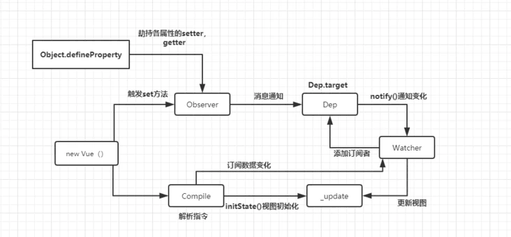

## :cat: 背景

前端项目 package.json 相当于后端 maven 项目 pom.xml 文件管理项目组件依赖。需要走 `npm install --save-dev xxxx` 引入方式。
对于项目中存在多项目共用的前端组件开发，不希望每次修改以发布版本再 `npm install` 下载包调试。
可以选用 [npm-link 方式](https://docs.npmjs.com/cli/v9/commands/npm-link/) 将前端组件 link 到场景 UI 中完成开发/联调/bug 修改工作。
最近前端同学发现，npm-link 方式引入的前端组件中引入 VUEX，且对 store 属性 watch 事件是不会生效。
个人觉得不应该，npm-link 就简单的将前端组件 link 到 UI，可以说是**原封**不动，包括 `node_modules`（最后发现也坏在此处）。
搜索 google 和百度都没有有效的帖子。

## :tiger: 问题跟进

### :one: 搞懂 VUEX store 的 watch 原理

**store watch 的初始化**

`vue` 初始化时，会调用 `initState` 其中，会针对本 `vue` 的 watch 完成 `initWatch` 初始化。其中初始化过程中会调用 `Vue.prototype.$watch` (注意，此处初始化用到的还是 vue 原型方法 $watch) 其中会触发一次 `watch handler` 方法。

```javascript
Vue.prototype.$watch = function (expOrFn, cb, options) {
    var vm = this;
    if (isPlainObject(cb)) {
      return createWatcher(vm, expOrFn, cb, options)
    }
    options = options || {};
    options.user = true;
    var watcher = new Watcher(vm, expOrFn, cb, options);
    if (options.immediate) {
      var info = "callback for immediate watcher \"" + (watcher.expression) + "\"";
      pushTarget();
      invokeWithErrorHandling(cb, vm, [watcher.value], vm, info);
      popTarget();
    }
    return function unwatchFn () {
      watcher.teardown();
    }
  };
```

在 `new Watcher` 对象第一次获取 `watcher.value` 时，触发 `watcher` 对象的 Dep 依赖。

```javascript
var Watcher = function Watcher (vm,  expOrFn,  cb,  options,  isRenderWatcher) {
  this.vm = vm;
  if (isRenderWatcher) {
    vm._watcher = this;
  }
  vm._watchers.push(this);
  // 隐藏不需要关注的代码
  // parse expression for getter
  if (typeof expOrFn === 'function') {
    this.getter = expOrFn;
  } else {
    this.getter = parsePath(expOrFn);
    if (!this.getter) {
      this.getter = noop;
    // 隐藏不需要关注的代码
    }
  }
  this.value = this.lazy
    ? undefined
    : this.get();
};
Watcher.prototype.get = function get () {
  // 指定 Dep.target 为 watcher
  pushTarget(this);
  var value;
  var vm = this.vm;
  try {
    value = this.getter.call(vm, vm);
  } catch (e) {
    if (this.user) {
      handleError(e, vm, ("getter for watcher \"" + (this.expression) + "\""));
    } else {
      throw e
    }
  } finally {
    if (this.deep) {
      traverse(value);
    }
    // 退出 Dep.target 的指向  
    popTarget();
    this.cleanupDeps();
  }
  return value
};
// 触发真实 get 时，完成了 watcher 的 Dep 依赖
Object.defineProperty(obj, key, {
    enumerable: true,
    configurable: true,
    // 忽略 set
    get: function reactiveGetter () {
        var value = getter ? getter.call(obj) : val;
        if (Dep.target) {
            dep.depend();
            if (childOb) {
                childOb.dep.depend();
                if (Array.isArray(value)) {
                    dependArray(value);
                }
            }
        }
        return value
	}
}
// 完成 Dep.target 添加依赖，此时的 Dep.target 是 watther 本身。而 this 为 store 的 dep 对象。
Dep.prototype.depend = function depend () {
  if (Dep.target) {
    Dep.target.addDep(this);
  }
};
// watcher 完成 addDep时，除了给自身 depId和 deps 加上 store dep对象，同样把自身watcher作为 store dep 的子关联
Watcher.prototype.addDep = function addDep (dep) {
  var id = dep.id;
  if (!this.newDepIds.has(id)) {
    this.newDepIds.add(id);
    this.newDeps.push(dep);
    if (!this.depIds.has(id)) {
      dep.addSub(this);
    }
  }
};
```

`Dep.prototype.depend` 完成调用时，store watcher 已经完成与 store 的 dep 对象的绑定过程。以上 `store watch init` 的链路如下，

```
depend (vue.common.dev.js:726)
reactiveGetter (vue.common.dev.js:1038)
prototypeAccessors$1.state.get (vuex.esm.js:438)
（匿名） (vue.common.dev.js:514)
get (vue.common.dev.js:4490)
Watcher (vue.common.dev.js:4479)
Vue.$watch (vue.common.dev.js:4953)
createWatcher (vue.common.dev.js:4913)
initWatch (vue.common.dev.js:4895)
initState (vue.common.dev.js:4656)
Vue._init (vue.common.dev.js:5010)
VueComponent (vue.common.dev.js:5157)
createComponentInstanceForVnode (vue.common.dev.js:3307)
init (vue.common.dev.js:3136)
```

**store watch 的触发**

`this.$store.commit('xxx', xxxx)` 触发时，在改值的同事会触发本 store Dep 的 notify （通知）。

```javascript
Object.defineProperty(obj, key, {
    enumerable: true,
    configurable: true,
    // 忽略 get
    set: function reactiveSetter (newVal) {
        var value = getter ? getter.call(obj) : val;
        /* eslint-disable no-self-compare */
        if (newVal === value || (newVal !== newVal && value !== value)) {
            return
        }
        /* eslint-enable no-self-compare */
        if (customSetter) {
            customSetter();
        }
        // #7981: for accessor properties without setter
        if (getter && !setter) { return }
        if (setter) {
            setter.call(obj, newVal);
        } else {
            val = newVal;
        }
        childOb = !shallow && observe(newVal);
        // 触发通知
        dep.notify();
    }
});
Dep.prototype.notify = function notify () {
  var subs = this.subs.slice();
 // 忽略不重要代码
  for (var i = 0, l = subs.length; i < l; i++) {
    // watcher update
    subs[i].update();
  }
};
```

其中 `notify` 的中遍历 Dep 的 subs 并更新，此处回想 watcher 初始化时 `watcher#addDep` 可见 subs 是包含 watcher 的，所以 store 属性变化也就能通知到 watcher 了。`store watch notify` 的链路如下，

```
handler (list_left.vue:411)
invokeWithErrorHandling (vue.common.dev.js:1868)
run (vue.common.dev.js:4579)
flushSchedulerQueue (vue.common.dev.js:4323)
（匿名） (vue.common.dev.js:1994)
flushCallbacks (vue.common.dev.js:1920)
Promise.then（异步）
timerFunc (vue.common.dev.js:1947)
nextTick (vue.common.dev.js:2004)
queueWatcher (vue.common.dev.js:4415)
update (vue.common.dev.js:4555)
notify (vue.common.dev.js:741)
reactiveSetter (vue.common.dev.js:1066)
proxySetter (vue.common.dev.js:4639)
changeAjlb (nav.vue:431)
```

以上，**watcher init** 和 **watcher 触发** 总结来说就是这个图。



### :two: 为啥 npm-link 不能触发 store watch

搞懂了，store watcher 这摊子事情，排查就相对简单了。**抓住 1 个位置即可，在 `initWatcher` 的时候是否完成了 `Watcher#addDep`。
** 结果发现，在 `Watcher.prototype.get`方法中 `pushTarget(this)`  Dep 指向 `webpack://${web_app}/./node_nodules/vue/dist/vue,common.dev.js`。
而在 `Object.defineProperty#get` 方法中 `Dep.target` 代码 Dep 指向
`webpack://${web_app}/${web_component}/node_modules/vue/dist/vue.common.dev.js`。 
摆明 Dep 已经不是原来的 Dep 了，导致 store Dep 与 watcher 没加成，导致 store watcher 不被触发。

**此时，我回想幸好是个女生，不然我就去楼下抽根烟了。这个后端 jar 包冲突可太像了。**

### :three: 如何解决问题

在场景层将 vue 定义成 window 全局对象。在组件内使用 `window.Vue` 装载  vuex。自此，问题终结。修改方式：

```javascript
// 在前端应用入口文件中
import vue from 'vue';
import vuex from 'vuex';
window.Vue = vue;
vue.use(vuex);
// 在被引用的组件入口文件中
import vuex from 'vuex';
if (window.Vue) {
    window.Vue.use(vuex);
} else {
    window.use(vuex);
}
```

## :rabbit: 总结

1. npm-link 固然解决了不用老改组件版本号调试的问题，但因为 npm-link 的组件会使用自身的 node_modules 导致，部分原本期望与场景 ui 共享的对象可能不共享。
2. 前端代码排查确是不如后端代码排查方便，啥 `console.warn` 都么得耗时长。

## :sheep: 附件
- [Vue源码解读之Dep,Observer和Watcher](https://segmentfault.com/a/1190000016208088)
