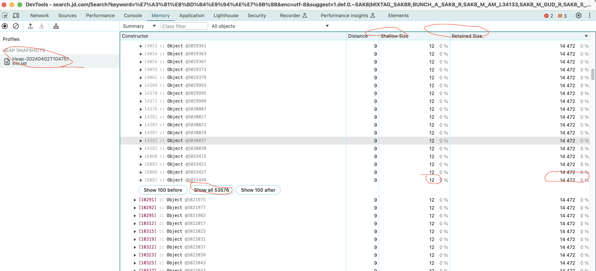

近期工作中针对档案文件型树展示完成优化。优化目标为在**秒级**装载页面，并且操作不允许卡顿。而基本要求支撑**万级**文件的展示与操作。

在优化之前，页面装载 5w 材料量全部装载完毕大约在 1-2 min ，时间包含后端提供数据时间 20-30 s。页面滚动或基本操作则无限卡顿，甚至浏览器会卡死崩溃。

让我记录的初衷是跌宕起伏的优化过程，这次的优化让我挺佩服公司前端部分工程师能力。

### :mosquito: 问题分析

1. 后端提供 5w 数据量耗时 20-30 s
2. 前端全部装载耗时 60-90 s
3. 前端全部 html 节点 > 5w 导致滚动后计算会出现渲染慢操作慢等问题

### :microscope: 逐个击破

#### 后端提供 5w 数量耗时 20-30 s

后端实现是，依据条件从数据库中装载 5w 材料 pojo 对象，然后遍历将 5w pojo 对象转换为 VO 对象。在遍历期间转换 VO 对象时需要因业务需要组装各种数据。

```java
// 数据查询位置
List<SusongJuan> juans = susongJuanMapper.getJuans(param);
List<SusongCailiao> susongCailiaos = ssdaMaterialMapper.selectByJuanbhAndFyId(param.getDabh(), juanbhs, param.getDassfy());
List<SusongMulu> mulus = susongMuluMapper.select(SusongMulu.builder().dabh(param.getDabh()).fy(param.getDassfy()).build());
// 数据组装部分
ssdaMaterialTreeService.buildSsdaCailiaoNode(susongCailiaos, mulus, juans);
// ssdaMaterialTreeService.buildSsdaCailiaoNode 数据组装逻辑
return susongCailiaos.stream().map(cailiao -> {
    CailiaoVO cailiaoVO = new CailiaoVO();
    // 属性复制及定制属性配置
    return cailiaoVO;
    }).collect(Collectors.toList());
```

看着代码步骤是比较简洁。先试用 [arthas trace](https://arthas.gitee.io/doc/trace.html#%E5%8F%82%E6%95%B0%E8%AF%B4%E6%98%8E) 分析各行代码执行情况，结果发现数据查询在 3-4 s，循环遍历耗时 25-27s。所以分为两步骤优化

首先数据查询部分优化 SQL，去掉 `juanbhs` 的 `in` 查询。并将 mybatis 对象类从 `SusongCailiao` 改为 `CailiaoVO`，避免了在循环遍历中的新对象资源申请耗时，和同属性拷贝耗时。最终数据查询部分优化后 1-1.5s。

循环遍历耗时 25-27s，相当于单对象转换耗时 500 ms，除了 CailiaoVO 同属性拷贝外，有两类属性设置，第一组装字符串、第二调用接口明确材料查阅 url。优化思路，线性改为并发，将 `stream()` 改为 `parallelStream()`，而至于排序问题在处理完转换之后再做业务排序。调用接口明确材料查阅 url（url 可能是直接请求打到存储服务器上）改为直接拼接后端服务器访问材料请求地址串，至于其他文件是否存在等判断不在此处做判断。最终循环遍历耗时 1-1.5s。

最终耗时从 60- 90s 降低到 2-3s，速度提升 20 倍。

#### 前端全部装载耗时 60-90s 且 前端全部 html 节点 > 5w （巨多）

前端绘制 5w 个 html 元素，一定是耗时长且卡的。前端同学找到了一种叫[虚拟列表](https://cloud.tencent.com/developer/article/2271375)，相当于通过计算整颗树的高度，搭配固定数量的 li 元素，来绘制文件树。至此，本以为优化结束。结果耗时还是需要 60s 甚至更久。

前端材料页码计算耗时特别长，最终在 5w 文件节点返回给前端时，在遍历树所有节点时，包含目录和材料。计算材料页码后会向上计算各层级目录的页码。

```javascript
/**
 * 总体说明，计算页码适合于树深度遍历.<br>
 * 非叶子节点有如下特征，node.children > 0.<br>
 * 叶子节点有如下特征， node.children = 0.<br>
 * 深度遍历时，非叶子节点需要加入 calcPageNodes 缓存对象中，相当于等待各个节点计算完毕页码才计算本节点页码的临时停留位置.<br>
 * 当遍历为叶子结点时，每个叶子结点组装页码数据之后向父节点通告本节点组装结果，供父节点更新页码.
 */
/**
 * 构造方法，按父计算页码节点和本树节点共同组成属性.
 * 1. 父计算页码节点
 * 2. 本节点起始页码
 * 3. 本节点结束页码
 * 4. 本节点页码
 * 5. 左侧树节点数据
 * 6. 是否计入档案页码
 * @param selfTreeNode 树节点本点
 * @param pCalcPageNode 父计算页码节点
 */
export class CalcPageNode {
    constructor(selfTreeNode, calcPageNodes) {
        this.pPageNode = calcPageNodes.getNode(selfTreeNode.pid);
        this.page = 0;
        this.childrenPageMap = new Map();
        this.childrenLength = selfTreeNode.children.length;
        selfTreeNode.children.forEach(subTreeNode => {
            this.childrenPageMap.set(subTreeNode.id, 0);
        });
        this.treeNode = selfTreeNode;
        if (!this.pPageNode) {
            this.calcDangPage = true;
            // this.calcDangPage = selfTreeNode.details.calcDangPage || false;
            this.startPageNo = 1;
            this.endPageNo = this.startPageNo;
            return;
        }
        this.calcDangPage = this.pPageNode.calcDangPage;
        if (selfTreeNode.type !== 'CAILIAO') {
            this.calcDangPage = this.calcDangPage && selfTreeNode.details.calcDangPage;
        }
        if (selfTreeNode.details.muluType === 'FEN_CE') {
            this.startPageNo = 1;
            this.endPageNo = this.startPageNo;
        } else {
            this.startPageNo = this.pPageNode.page === 0 ? this.pPageNode.endPageNo : this.pPageNode.endPageNo + 1;
            this.endPageNo = this.startPageNo;
        }
    }
    destory() {
        this.pPageNode = null;
        this.page = null;
        this.childrenPageMap.clear();
        this.childrenPageMap = null;
        this.childrenLength = null;
        this.treeNode = null;
        this.calcDangPage = null;
        this.startPageNo = null;
        this.endPageNo = null;
    }
    /**
     *  是否是叶子节点判断，只用依据 children 是不是空判断.
     * @returns {boolean}
     * @private
     */
    _isLeaf() {
        return this.childrenLength === 0;
    }
    /**
     * 计算单叶子节点的页码，当让是档案认为需要计算的页码.
     */
    calcPage() {
        if (!this._isLeaf() || !this.calcDangPage) {
            // console.info('当前节点非叶子节点，等待子节点回调');
            return;
        }
        if (this.treeNode.type === 'MULU' || this.treeNode.type === 'JUAN') {
            return;
        }
        if (this.treeNode.type === 'CAILIAO') {
            this.page = this.treeNode.details.pages || 0;
            this._buildPageInfo();
            if (this.pPageNode) {
                this.pPageNode._pageNodeNotice(this, true);
            }
            return;
        }
        console.error(`不支持的树节点类型【${this.treeNode.type}】节点编号【${this.treeNode.id}】`);
    }
    /**
     * 填充树节点 page 信息.
     * @private
     */
    _buildPageInfo() {
        if (this._isLeaf()) {
            if (this.page) {
                this.endPageNo = this.startPageNo + this.page - 1;
                if (this.treeNode.type === 'CAILIAO' || this.treeNode.type === 'MULU') {
                    if (this.page === 1) {
                        this.treeNode.pageInfo = `${this.startPageNo}`;
                    } else {
                        this.treeNode.pageInfo = `${this.startPageNo} - ${this.endPageNo}`;
                    }
                }
            }
            return;
        }
        let page = 0;
        this.childrenPageMap.forEach((value) => {
            page += value;
        });
        this.page = page;
        this.endPageNo = this.startPageNo + this.page - 1;
        if (this.treeNode.type === 'MULU' && this.page) {
            this.treeNode.pageInfo = `${this.startPageNo} - ${this.endPageNo}`;
        }
        if (this.treeNode.type === 'JUAN' && this.page) {
            this.treeNode.pageInfo = `${this.page} 页`;
        }
    }
    _pageNodeNotice(childPageNode) {
        this.childrenPageMap.set(childPageNode.treeNode.id, childPageNode.page);
        this._buildPageInfo();
        if (this.pPageNode) {
            this.pPageNode._pageNodeNotice(this);
        }
    }
}
export class PageNodes {
    constructor() {
        this.pageNodes = new Map();
    }
    addNode(calcPageNode) {
        this.pageNodes.set(calcPageNode.treeNode.id, calcPageNode);
    }
    getNode(id) {
        return this.pageNodes.get(id);
    }
    clearAll() {
        this.pageNodes.forEach(pageNode => pageNode.destory());
        this.pageNodes.clear();
        this.pageNodes = null;
    }
}
```

优化完之后，页码计算耗时大约在 2- 3s 左右。也就是前端 + 后端总共耗时在 5-6s 左右。喝了会儿茶之后，发现页面崩溃了。我艹，怎么崩溃了，啥操作都没有。结果发现，刷新页面 5-6s 装载完成之后，chrome 前端内存占用为 2.5 GB，这有点诡异了，最大的材料节点请求响应大约是 4.6 MB，单页面 vue 大约内存在 100 MB 左右。所以就这些数据怎么就 2.5 GB 呢？因为内存占用太大，我去掉了页面基本所有内容，只剩下材料请求和结果响应部分。结果发现，每个材料节点被回收的话，材料数据自身被回收大约能到 14KB 左右，大小 14KB x 53576 = 732 MB。



基本上问题就在这里了，基本能确定的是，在 vue2 data 中定义的结构在赋值之后，会需要比原本对象更多的内存去管理属性。

```javascript
// 改造前内容
export default {
    data() {
        return {
            // 材料数据
            materialData: []
        };
    }
}
```

改造后，是将 5w 的材料以缓存的形式，放在 windows 对象中，操作什么的都用缓存提供的数据完成装载、操作及刷新。

```javascript
/**
 * 材料树缓存. 与 window.fd 配合使用，ta 的初始化在树触发 ready 方法后方可做本材料树缓存.
 * 完整的属性结构，缩略图和树都用同一份树型数据.
 * 主要由两部分组成，一部分是目录树，一部分是材料列表，最终组装成档案树.
 */
class MaterialTreeData {
    /**
     * treeData: 档案树<br>
     * initLoadMulu: 是否初始化了目录，结合 initLoadCailiaos 一起做档案树初始化判断 <br>
     * initLoadCailiaos: 是否初始化了材料，结合 initLoadMulu 一起做档案树初始化判断 <br>
     */
    constructor(daTree) {
        this.treeData = [];
        this.thumbLastMuluData = [];
        this.initLoadMulu = false;
        this.initLoadCailiaos = false;
        this.daTree = daTree;
    }

    /**
     * 装载目录树.
     * @param muluTreeData 数组结构，因为一个卷一个树根节点.
     * @param refreshDaTree 是否直接刷新档案树
     */
    initMulus(muluTreeData, refreshDaTree = false) {
        this.treeData.push(...muluTreeData);
        this.initLoadMulu = true;
        if (refreshDaTree) {
            this.daTree.update(this.treeData);
        }
    }

    /**
     * 注意，材料的初始化得在目录之后，不想做过多时间前后的兼容，所以请在调用的时候，先请求目录再请求材料.
     * 装载材料列表.将材料列表装载进树里.
     *
     * @param cailiaoData 材料列表数据
     * @param refreshDaTree 是否直接刷新档案树
     */
    initCailiaos(cailiaoData, refreshDaTree = false) {
        if (!this.initLoadMulu) {
            console.error('材料列表初始化到档案树得在目录之后，不想做过多时间前后的兼容，所以请在调用的时候，先请求目录再请求材料');
            return;
        }
        if (!cailiaoData || !cailiaoData.length) {
            console.info('材料列表为空，直接结束');
            this.initLoadCailiaos = true;
            return;
        }
        this._composeCailiao2DaTree(cailiaoData, this.treeData, this.thumbCailiaoData);
        this.initLoadCailiaos = true;
        if (refreshDaTree) {
            this.daTree.update(this.treeData, () => {
                this.daTree.gUpdateCurrentDataList(this._getFirstLeaf());
            });
        }
    }

    /**
     * 只提供需要的基础属性的树节点.
     */
    getSimpleJuanTreeNode() {
        const juans = [];
        this.treeData.forEach(juan => {
            const simpleJuan = {
                details: juan.details,
                id: juan.id,
                name: juan.name,
                order: juan.order,
                pageInfo: juan.pageInfo,
                pid: juan.pid,
                type: juan.type
            };
            juans.push(simpleJuan);
        });
        return juans;
    }

    getThumbLastMuluData() {
        return this.thumbLastMuluData;
    }

    getTreeData() {
        return this.treeData;
    }

    _getFirstLeaf() {
        if (!this.treeData || !this.treeData.length) {
            return;
        }
        let treeNode = this.treeData[0];
        while (treeNode) {
            if (!treeNode.children || !treeNode.children.length) {
                break;
            }
            treeNode = treeNode.children[0];
        }
        return treeNode;
    }

    /**
     * 组合档案树和材料列表，其中档案树得现有目录数据，前面 initCailiaos 已经有前置位判断.
     * @param cailiaoData 材料列表数据
     * @param muluTreeData 目录树
     * @private
     */
    _composeCailiao2DaTree(cailiaoData, muluTreeData, thumbCailiaoData) {
        if (cailiaoData && !cailiaoData.length) {
            return;
        }
        const cailiaoByPidGroup = this._group(cailiaoData, cailiao => cailiao.pid);
        this._composeCailiao2Mulus(muluTreeData, cailiaoByPidGroup, thumbCailiaoData);
    }

    /**
     * 遍历树节点，往目录节点同级或下级添加材料节点.
     *
     * @param muluTreeNodes 目录集合
     * @param cailiaoByPidGroup 分组
     * @private
     */
    _composeCailiao2Mulus(muluTreeNodes, cailiaoByPidGroup, thumbCailiaoData) {
        for (let index = 0; index < muluTreeNodes.length; index++) {
            const muluTreeNode = muluTreeNodes[index];
            if (muluTreeNode.children && muluTreeNode.children.length) {
                this._composeCailiao2Mulus(muluTreeNode.children, cailiaoByPidGroup, thumbCailiaoData);
                this._composeCailiao2Mulu(muluTreeNode, cailiaoByPidGroup, thumbCailiaoData);
            } else {
                this._composeCailiao2Mulu(muluTreeNode, cailiaoByPidGroup, thumbCailiaoData);
            }
        }
    }

    /**
     * 将归属本目录的材料添加到 children 中.
     * @param muluTreeNode 目录节点
     * @param cailiaoByPidGroup 分组
     * @private
     */
    _composeCailiao2Mulu(muluTreeNode, cailiaoByPidGroup, thumbCailiaoData) {
        const cailiaos = cailiaoByPidGroup[muluTreeNode.id] || [];
        if (cailiaos.length && muluTreeNode.type === 'MULU') {
            delete cailiaoByPidGroup[muluTreeNode.id];
            muluTreeNode.children = muluTreeNode.children || [];
            muluTreeNode.children.push(...cailiaos);
            // 因为目录下节点有材料和子目录，所以用这个参数装载只是材料节点.
            muluTreeNode.cailiaoChildren = [];
            muluTreeNode.cailiaoChildren.push(...cailiaos);
            this.thumbLastMuluData.push(muluTreeNode);
        }
    }

    /**
     * 分组，数组元素按照元素某个属性值做分组，返回结构为 Map<Property, List<Item>>
     * @param array 数组
     * @param keyFunc 属性获取函数
     * @returns {*} Map<Property, List<Item>>
     * @private
     */
    _group(array, keyFunc) {
        return array.reduce((groups, item) => {
            const key = keyFunc(item);
            if (!groups[key]) {
                groups[key] = [];
            }
            groups[key].push(item);
            return groups;
        }, {});
    }
}

export const materialTreeCache = {
    createMaterialTreeCache: function (daTree, dabh) {
        if (!daTree || !dabh) {
            console.error('创建材料树缓存时，档案树和档案编号都不可为空');
            return;
        }
        if (type(window.globalTreeCacheObject) !== 'object') {
            window.globalTreeCacheObject = {};
        }
        // 创建缓存对象
        window.globalTreeCacheObject[`materialTreeCache_${dabh}`] = new MaterialTreeData(daTree);
    },

    getMaterialTreeCache: function (dabh) {
        if (!dabh) {
            console.error('获取材料树缓存时，档案编号不可为空');
            return null;
        }
        if (type(window.globalTreeCacheObject) !== 'object') {
            console.error('获取材料树缓存时，全局树缓存对象不可为空');
            return null;
        }
        return window.globalTreeCacheObject[`materialTreeCache_${dabh}`];
    },

    destoryMaterialTreeCache: function (dabh) {
        if (!dabh) {
            console.error('销毁材料树缓存时，档案编号不可为空');
            return;
        }
        if (type(window.globalTreeCacheObject) !== 'object') {
            console.error('销毁材料树缓存时，全局树缓存对象不可为空');
            return;
        }
        delete window.globalTreeCacheObject[`materialTreeCache_${dabh}`];
    }
};
```

重构后，前端内存占用稳定在 200-300 MB。

### :fuelpump: 总结

1. 数据量大时，尽可能减少计算工作及接口调用。

2. 善用算法，不要死板的完成计算。利用树的深度遍历，计算各个目录和材料页码范围。

3. 学习到虚拟列表，对数据节点多的前端装载优化。

4. 数据量大时，不要用 vue2 的 data 属性管理数据。
