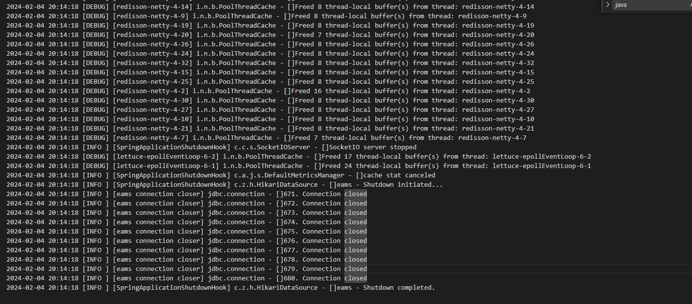

出乎意外的 “系统宕机”

我徒弟一个刚毕业的精神小伙，近期处理现场提交的工单问题。驻地告诉他系统每天在用户下班后会宕机，需要他每天上班启动系统。徒弟没什么经验，就让线程调大内存参数 `-Xmx 16g -Xms 8g` 观察。第二天，驻地还是告诉他依旧是用户下班后会宕机。徒弟也是摸不到头脑找到了我。

### 出乎意外，情理之中

首先，确定是否内存 OOM 导致宕机。在图片中是通过 `-XX:+HeapDumpOnOutOfMemoryError` 启动 OOM 是生成堆 dump 文件， OOM 是堆 dump 文件 `-XX:HeapDumpPath` 配置指定位置。 是否存在堆 dump 文件。**驻地回答说目录下没有任何文件。难道 OOM 启动配置是后加的？**

其次，让驻地通过 linux 系统日志看能不能找到 OOM 的蛛丝马迹。随即发去搜索命令 `dmesg | grep -i -B10 'killed process'` 和 `grep -i 'killed process' /var/log/messages` 。**驻地回答说没有任何内容输出。**

再想想驻地说的话，都是下班后宕机，下班后系统业务并不多，想再看看系统日志，确定什么时候宕机的。结果发现直到 `23:59:59` 都有数据库链接的测试日志。那是凌晨宕机？但是日志已经被驻地手动启动覆盖了。:star2: **手动启动** ，回看图片驻地的启动方式是命令行里输入 `java -jar xxx.jar &` 这是同步启动非后台启动，如果出现窗口失效断开连接的话，是会让程序走正常系统退出，驻地发回来的退出系统照片能匹配上。

最终，让他修改成 `nohup java -jar xxx.jar > /dev/null 2>&1 &` 启动，第二天不再出现所谓的 "系统宕机"。

